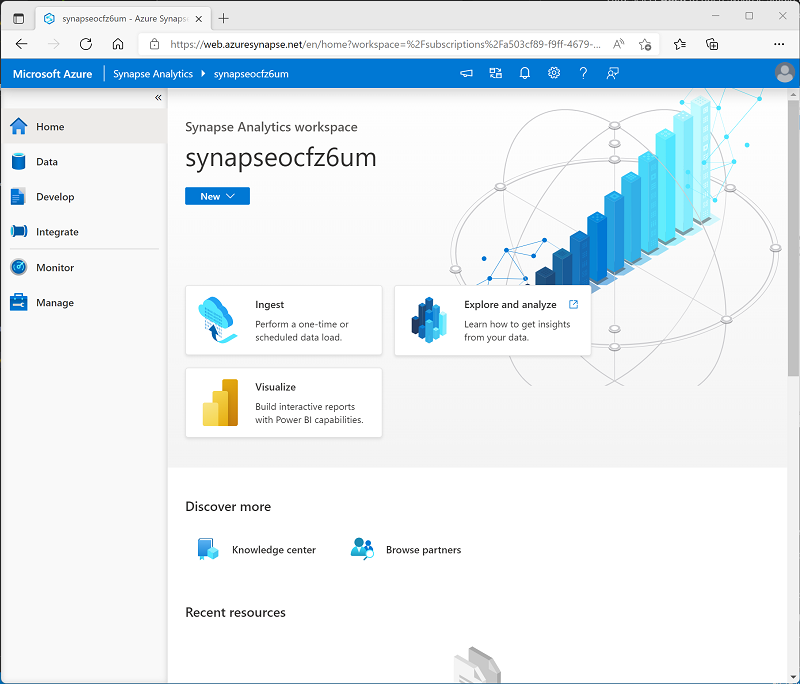

---
lab:
  title: Erkunden von Azure Synapse Analytics
  ilt-use: Lab
---

# Erkunden von Azure Synapse Analytics

Azure Synapse Analytics bietet eine einzige, konsolidierte Datenanalyseplattform für End-to-End-Datenanalysen. In dieser Übung werden Sie verschiedene Möglichkeiten zum Erfassen und Untersuchen von Daten erkunden. Diese Übung ist eine allgemeine Übersicht über die verschiedenen Kernfunktionen von Azure Synapse Analytics. Weitere Übungen stehen zur Verfügung, um spezifische Funktionen ausführlicher zu erkunden.

Diese Übung dauert ca. **60** Minuten.

## Vorbereitung

Sie benötigen ein [Azure-Abonnement](https://azure.microsoft.com/free), in dem Sie Administratorzugriff besitzen.

## Bereitstellen eines Azure Synapse Analytics-Arbeitsbereichs

Ein Azure Synapse Analytics-Arbeitsbereich ** bietet einen zentralen Punkt für die Verwaltung von Daten und Datenverarbeitungslaufzeiten. Sie können einen Arbeitsbereich mithilfe der interaktiven Benutzeroberfläche im Azure-Portal bereitstellen, oder Sie können einen Arbeitsbereich und darin befindliche Ressourcen mithilfe eines Skripts oder einer Vorlage bereitstellen. In den meisten Produktionsszenarien empfiehlt es sich, die Bereitstellung mit Skripten oder Vorlagen zu automatisieren, damit Sie die Ressourcenbereitstellung in einen wiederholbaren *DevOps-Prozess* (Development/Operations, Entwicklung/Betrieb) integrieren können.

In dieser Übung verwenden Sie eine Kombination aus einem PowerShell-Skript und einer ARM-Vorlage, um einen Azure Synapse Analytics-Arbeitsbereich bereitzustellen.

1. Melden Sie sich in einem Browser beim [Azure-Portal](https://portal.azure.com) unter `https://portal.azure.com` an.
2. Verwenden Sie rechts neben der Suchleiste oben auf der Seite die Schaltfläche **[\>_]**, um eine neue Cloud Shell-Instanz im Azure-Portal zu erstellen. Wählen Sie eine ***PowerShell***-Umgebung aus, und erstellen Sie Speicher, falls Sie dazu aufgefordert werden. Die Cloud Shell bietet eine Befehlszeilenschnittstelle in einem Bereich am unteren Rand des Azure-Portals, wie hier gezeigt:

    

    > **Hinweis**: Wenn Sie zuvor eine Cloud Shell erstellt haben, die eine *Bash*-Umgebung verwendet, ändern Sie diese mithilfe des Dropdownmenüs oben links im Cloud Shell-Bereich zu ***PowerShell***.

3. Beachten Sie, dass Sie die Größe der Cloud Shell durch Ziehen der Trennzeichenleiste oben im Bereich ändern können oder den Bereich mithilfe der Symbole **&#8212;**, **&#9723;** und **X** oben rechts minimieren, maximieren und schließen können. Weitere Informationen zur Verwendung von Azure Cloud Shell finden Sie in der [Azure Cloud Shell-Dokumentation](https://docs.microsoft.com/azure/cloud-shell/overview).

4. Geben Sie im PowerShell-Bereich die folgenden Befehle ein, um dieses Repository zu klonen:

    ```
    rm -r dp-203 -f
    git clone https://github.com/MicrosoftLearning/dp-203-azure-data-engineer dp-203
    ```

5. Nachdem das Repository geklont wurde, geben Sie die folgenden Befehle ein, um in den Ordner für diese Übung zu wechseln. Führen Sie das darin enthaltene Skript **setup.ps1** aus:

    ```
    cd dp-203/Allfiles/labs/01
    ./setup.ps1
    ```

6. Wenn Sie dazu aufgefordert werden, wählen Sie aus, welches Abonnement Sie verwenden möchten (dies geschieht nur, wenn Sie Zugriff auf mehrere Azure-Abonnements haben).
7. Wenn Sie dazu aufgefordert werden, geben Sie ein geeignetes Kennwort ein, das für Ihren Azure Synapse SQL-Pool festgelegt werden soll.

    > **Hinweis**: Merken Sie sich unbedingt dieses Kennwort! Darüber hinaus darf im Kennwort der Anmeldename nicht enthalten sein, und auch nicht ein Teil desselben.

8. Warten Sie, bis das Skript abgeschlossen ist – dies dauert in der Regel etwa 20 Minuten, aber in einigen Fällen kann es länger dauern. Während Sie warten, lesen Sie den Artikel [Was ist Azure Synapse Analytics?](https://docs.microsoft.com/azure/synapse-analytics/overview-what-is) in der Dokumentation zu Azure Synapse Analytics.

## Einstieg in Azure Synapse Studio

*Synapse Studio* ist eine webbasierte Oberfläche, in der Sie mit Ihrem Synapse Analytics-Arbeitsbereich arbeiten können.

1. Wenn das Setupskript ausgeführt wurde, wechseln Sie im Azure-Portal zur von ihr erstellten Ressourcengruppe **dp203-*xxxxxxx*** und beachten Sie, dass diese Ressourcengruppe Ihren Synapse-Arbeitsbereich, ein Speicherkonto für Ihren Data Lake, einen Apache Spark-Pool, einen Daten-Explorer-Pool und einen dedizierten SQL-Pool enthält.
2. Wählen Sie Ihren Synapse-Arbeitsbereich aus, und klicken Sie auf der Seite **Übersicht** der Karte **Synapse Studio öffnen** auf die Option **Öffnen**, um Synapse Studio auf einer neuen Browserregisterkarte zu öffnen. Synapse Studio ist eine webbasierte Schnittstelle, die Sie zum Arbeiten mit Ihrem Synapse Analytics-Arbeitsbereich verwenden können.
3. Verwenden Sie auf der linken Seite von Synapse Studio das Symbol **&rsaquo;&rsaquo;**, um das Menü zu erweitern. Dadurch werden die verschiedenen Seiten in Synapse Studio angezeigt, die Sie zum Verwalten von Ressourcen und zum Ausführen von Datenanalyseaufgaben verwenden, wie im Folgenden gezeigt:

    

4. Zeigen Sie die Seite **Daten** an, und beachten Sie, dass zwei Registerkarten mit Datenquellen vorhanden sind:
    - Eine Registerkarte **Arbeitsbereich** mit Datenbanken, die im Arbeitsbereich definiert sind (einschließlich dedizierter SQL-Datenbanken und Daten-Explorer-Datenbanken)
    - Eine Registerkarte **Verknüpft** mit Datenquellen, die mit dem Arbeitsbereich verknüpft sind, einschließlich Azure Data Lake-Speicher.

5. Zeigen Sie die Seite **Entwickeln** an, die zurzeit leer ist. Hier können Sie Skripts und andere Ressourcen definieren, die zum Entwickeln von Datenverarbeitungslösungen verwendet werden.
6. Zeigen Sie die Seite **Integrieren** an, die ebenfalls leer ist. Sie verwenden diese Seite, um Datenaufnahme- und Integrationsressourcen zu verwalten; z. B. Pipelines zum Übertragen und Transformieren von Daten zwischen Datenquellen.
7. Zeigen Sie die Seite **Monitor** an. Hier können Sie Datenverarbeitungsaufträge beobachten, während sie ausgeführt werden und deren Verlauf anzeigen.
8. Zeigen Sie die Seite **Verwalten** an. Hier verwalten Sie die Pools, Laufzeiten und anderen Ressourcen, die in Ihrem Azure Synapse-Arbeitsbereich verwendet werden. Zeigen Sie die einzelnen Registerkarten im Abschnitt **Analysepools** an und beachten Sie, dass Ihr Arbeitsbereich die folgenden Pools enthält:
    - **SQL-Pools**:
        - **Integriert**: Ein *serverloser* SQL-Pool, den Sie bei Bedarf verwenden können, um Daten in einem Data Lake mithilfe von SQL-Befehlen zu untersuchen oder zu verarbeiten.
        - **sql*xxxxxxx***: Ein *dedizierter* SQL-Pool, der eine relationale Data Warehouse-Datenbank hostet.
    - **Apache Spark-Pools**:
        - **spark*xxxxxxx***: Sie können Daten in einem Data Lake mithilfe von Programmiersprachen wie Scala oder Python auf Bedarf untersuchen oder verarbeiten.

## Erfassen von Daten mit einer Pipeline

Eine der wichtigsten Aufgaben, die Sie mit Azure Synapse Analytics ausführen können, ist das Definieren von *Pipelines*, die Daten aus einer Vielzahl von Quellen zur Analyse in Ihren Arbeitsbereich übertragen (und bei Bedarf transformieren).

### Erstellen einer Pipeline mithilfe der Aufgabe „Daten kopieren“

1. Wählen Sie in Synapse Studio auf der **Startseite** die Option **Erfassen** aus, um das Werkzeug **Daten kopieren** zu öffnen.
2. Stellen Sie im Tool „Daten kopieren “im Schritt **Eigenschaften** sicher, dass die Optionen **Integrierte Kopieraufgabe** und **Jetzt einmal ausführen** ausgewählt sind, und klicken Sie auf **Weiter >**.
3. Wählen Sie im Schritt **Quelle** im Teilschritt **Dataset** die folgenden Einstellungen aus:
    - **Quelltyp**: Alle
    - **Verbindung**: *Erstellen Sie eine neue Verbindung, und wählen Sie im Fenster **Verknüpfter Dienst** auf der Registerkarte **Generisches Protokoll** die Option **HTTP** aus. Erstellen Sie dann unter Verwendung der folgenden Einstellungen eine Verbindung mit einer Datendatei:*
        - **Name**: Produkte
        - **Beschreibung**: Produktliste über HTTP
        - **Verbindung über Integration Runtime herstellen**: AutoResolveIntegrationRuntime
        - **Basis-URL**: `https://raw.githubusercontent.com/MicrosoftLearning/dp-203-azure-data-engineer/master/Allfiles/labs/01/adventureworks/products.csv`
        - **Überprüfung des Serverzertifikats**: Aktivieren
        - **Authentifizierungstyp**: Anonym
4. Stellen Sie nach dem Erstellen der Verbindung sicher, dass auf der Seite **Quellendatenspeicher** die folgenden Einstellungen ausgewählt sind, und klicken Sie dann auf **Weiter >**:
    - **Relative URL**: *Nicht ausfüllen*
    - **Anforderungsmethode**: GET
    - **Zusätzliche Kopfzeilen**: *Nicht ausfüllen*
    - **Binärkopie**: <u>Nicht</u>ausgewählt
    - **Anforderungstimeout**: *Nicht ausfüllen*
    - **Maximal zulässige Anzahl paralleler Verbindungen**: *Nicht ausfüllen*
5. Wählen Sie im Schritt **Quelle** im Teilschritt **Konfiguration** die Option **Vorschaudaten** aus, um eine Vorschau der von Ihrer Pipeline erfassten Produktdaten anzuzeigen, und schließen Sie dann die Vorschau.
6. Stellen Sie nach dem Anzeigen der Datenvorschau sicher, dass auf der Seite **Dateiformat Einstellungen** die folgenden Einstellungen ausgewählt sind, und klicken Sie dann auf **Weiter >**:
    - **Dateiformat**: DelimitedText
    - **Spaltentrennzeichen**: Komma (,)
    - **Zeilen-Trennzeichen**: Zeilenvorschub (\n)
    - **Erste Zeile ist Überschrift**: Ausgewählt
    - **Komprimierungstyp**: Keiner
7. Wählen Sie im Schritt **Ziel** im Teilschritt **Dataset** die folgenden Einstellungen aus:
    - **Zieltyp**: Azure Data Lake Storage Gen 2
    - **Verbindung**: *Wählen Sie die vorhandene Verbindung mit Ihrem Data Lake-Speicher aus (diese wurde bei der Erstellung des Arbeitsbereichs für Sie erstellt).*
8. Stellen Sie nach Auswahl der Verbindung sicher, dass im Schritt **Ziel/Dataset** die folgenden Einstellungen ausgewählt sind, und klicken Sie dann auf **Weiter >**:
    - **Ordnerpfad**: Dateien/product_data
    - **Dateiname**: products.csv
    - **Kopierverhalten**: Keins
    - **Maximal zulässige Anzahl paralleler Verbindungen**: *Nicht ausfüllen*
    - **Blockgröße (MB)**: *Nicht ausfüllen*
9. Stellen Sie im Schritt **Ziel** im Teilschritt **Konfiguration**, auf der Seite **Dateiformat Einstellungen** sicher, dass die folgenden Eigenschaften ausgewählt sind. Klicken Sie anschließend auf **Weiter >**.
    - **Dateiformat**: DelimitedText
    - **Spaltentrennzeichen**: Komma (,)
    - **Zeilen-Trennzeichen**: Zeilenvorschub (\n)
    - **Header zu Datei hinzufügen**: Ausgewählt
    - **Komprimierungstyp**: Keiner
    - **Maximale Zeilenanzahl pro Datei**: *Nicht ausfüllen*
    - **Dateinamenpräfix**: *Nicht ausfüllen*
10. Konfigurieren Sie im Schritt **Einstellungen** die folgenden Einstellungen, und klicken Sie dann auf **Weiter >**.
    - **Aufgabenname**: Kopieren von Produkten
    - **Aufgabenbeschreibung**: Kopieren von Produktdaten
    - **Fehlertoleranz**: *Nicht ausfüllen*
    - **Protokollierung aktivieren**: <u>Nicht</u> ausgewählt
    - **Staging aktivieren**: <u>Nicht</u> ausgewählt
11. Lesen Sie im Schritt **Überprüfen und fertig stellen** im Teilschritt **Überprüfen** die Zusammenfassung, und klicken Sie dann auf **Weiter >**.
12. Warten Sie im Schritt **Bereitstellung**, bis die Pipeline bereitgestellt wurde, und klicken Sie dann auf **Fertig stellen**.
13. Wählen Sie in Synapse Studio die Seite **Überwachen** aus, und warten Sie, bis auf der Registerkarte **Pipelineausführung** die Pipeline **Produkte kopieren** mit dem Status **Erfolgreich** ausgeführt wurde. (Über die Schaltfläche **&#8635; Aktualisieren** auf der Seite „Pipelineausführung“ können Sie den Status aktualisieren.)
14. Zeigen Sie die Seite **Integrieren** an und stellen Sie sicher, dass sie jetzt eine Pipeline mit dem Namen **Produkte kopieren** enthält.

### Anzeigen der erfassten Daten

1. Wählen Sie auf der Seite **Daten** die Registerkarte **Verknüpft** aus und erweitern Sie die Containerhierarchie **synapse*xxxxxxx* (Primär) Datalake**, bis der **Dateien** Dateispeicher für Ihren Synapse-Arbeitsbereich angezeigt wird. Wählen Sie dann den Dateispeicher aus, um zu überprüfen, ob der Order **product_data**, der eine Datei namens **products.csv** enthält, an diesen Speicherort kopiert wurde, wie hier gezeigt:

    

2. Klicken Sie mit der rechten Maustaste auf die Datei **products.csv** und wählen Sie **Vorschau** aus, um die erfassten Daten anzuzeigen. Schließen Sie dann die Vorschau.

## Verwenden eines serverlosen SQL-Pools zum Analysieren von Daten

Nachdem Sie nun einige Daten in Ihrem Arbeitsbereich erfasst haben, können Sie Synapse Analytics verwenden, um die Daten abzufragen und zu analysieren. Eine der gängigsten Methoden zum Abfragen von Daten ist die Verwendung von SQL. In Synapse Analytics können Sie zum Ausführen von SQL-Code gegen Daten in einem Data Lake einen serverlosen SQL-Pool verwenden.

1. Klicken Sie in Synapse Studio mit der rechten Maustaste auf die **products.csv**-Datei im Dateispeicher Ihres Synapse-Arbeitsbereichs, zeigen Sie auf **Neues SQL-Skript**, und wählen Sie **Die ersten 100 Zeilen auswählen** aus.
2. Überprüfen Sie im geöffneten Bereich **SQL-Skript 1** den generierten SQL Code, der in etwa wie der folgende lauten sollte:

    ```SQL
    -- This is auto-generated code
    SELECT
        TOP 100 *
    FROM
        OPENROWSET(
            BULK 'https://datalakexxxxxxx.dfs.core.windows.net/files/product_data/products.csv',
            FORMAT = 'CSV',
            PARSER_VERSION='2.0'
        ) AS [result]
    ```

    Dieser Code öffnet ein Rowset aus der importierten Textdatei und ruft die ersten 100 Datenzeilen ab.

3. Vergewissern Sie sich, dass in der Liste **Verbinden mit** die Option **Integriert** ausgewählt ist. Dies entspricht dem integrierten SQL-Pool, der mit Ihrem Arbeitsbereich erstellt wurde.
4. Verwenden Sie die Symbolleistenschaltfläche **&#9655; Ausführen**, um den SQL-Code auszuführen, und überprüfen Sie die Ergebnisse, die in etwa wie folgt aussehen sollten:

    | C1 | C2 | C3 | C4 |
    | -- | -- | -- | -- |
    | ProductID | ProductName | Kategorie | ListPrice |
    | 771 | Mountain-100 Silver, 38 | Mountainbikes | 3399.9900 |
    | 772 | Mountain-100 Silver, 42 | Mountainbikes | 3399.9900 |
    | ... | ... | ... | ... |

5. Beachten Sie, dass die Ergebnisse aus vier Spalten mit den Namen C1, C2, C3 und C4 bestehen und dass die erste Zeile in den Ergebnissen die Namen der Datenfelder enthält. Um dieses Problem zu beheben, fügen Sie der OPENROWSET-Funktion wie hier gezeigt einen Parameter HEADER_ROW = TRUE hinzu (ersetzen Sie dabei *datalakexxxxxxx* durch den Namen Ihres Data Lake-Speicherkontos), und führen Sie dann die Abfrage erneut aus:

    ```SQL
    SELECT
        TOP 100 *
    FROM
        OPENROWSET(
            BULK 'https://datalakexxxxxxx.dfs.core.windows.net/files/product_data/products.csv',
            FORMAT = 'CSV',
            PARSER_VERSION='2.0',
            HEADER_ROW = TRUE
        ) AS [result]
    ```

    Die Ergebnisse sehen nun wie folgt aus:

    | ProductID | ProductName | Kategorie | ListPrice |
    | -- | -- | -- | -- |
    | 771 | Mountain-100 Silver, 38 | Mountainbikes | 3399.9900 |
    | 772 | Mountain-100 Silver, 42 | Mountainbikes | 3399.9900 |
    | ... | ... | ... | ... |

6. Ändern Sie die Abfrage wie folgt (ersetzen Sie *datalakexxxxxxx* durch den Namen Ihres Data Lake-Speicherkontos):

    ```SQL
    SELECT
        Category, COUNT(*) AS ProductCount
    FROM
        OPENROWSET(
            BULK 'https://datalakexxxxxxx.dfs.core.windows.net/files/product_data/products.csv',
            FORMAT = 'CSV',
            PARSER_VERSION='2.0',
            HEADER_ROW = TRUE
        ) AS [result]
    GROUP BY Category;
    ```

7. Führen Sie die geänderte Abfrage aus, die ein Resultset zurückgeben sollte, das die folgende Produktanzahl in den jeweiligen Kategorien enthält:

    | Kategorie | ProductCount |
    | -- | -- |
    | Trägershorts | 3 |
    | Fahrradträger | 1 |
    | ... | ... |

8. Ändern Sie im Bereich **Eigenschaften** den **Namen** für **SQL-Skript 1** in **Produkte nach Kategorie zählen**. Klicken Sie dann auf der Symbolleiste auf **Veröffentlichen**, um das Skript zu speichern.

9. Schließen Sie den Skriptbereich **Produkte nach Kategorie zählen**.

10. Wählen Sie in Synapse Studio die Seite **Entwickeln** aus. Wie Sie sehen, ist hier Ihr veröffentlichtes SQL-Skript **Produkte nach Kategorie zählen** gespeichert.

11. Wählen Sie das SQL-Skript **Produkte nach Kategorie zählen** aus, um es erneut zu öffnen. Vergewissern Sie sicher, dass das Skript mit dem **integrierten** SQL-Pool verbunden ist, und führen Sie es aus, um die Produktanzahl abzurufen.

12. Wählen Sie im **Ergebnisbereich** die **Diagrammansicht** aus, und nehmen Sie folgende Einstellungen für das Diagramm vor:
    - **Diagrammtyp**: Spalte
    - **Kategoriespalte**: Kategorie
    - **Legendenspalten (Reihen)**: ProductCount
    - **Legendenposition**: Unten zentriert
    - **Legendenbeschriftung (Reihen)**: *Nicht ausfüllen*
    - **Mindestwert für Legende (Reihe)**: *Nicht ausfüllen*
    - **Höchstwert für Legende (Reihen)**: *Nicht ausfüllen*
    - **Kategoriebezeichnung**: *Nicht ausfüllen*

    Das resultierende Diagramm sollte in etwa wie folgt aussehen:

    

## Verwenden eines Spark-Pools zum Analysieren von Daten

Während SQL eine gängige Sprache zum Abfragen strukturierter Datasets ist, finden viele Datenanalysten Sprachen wie Python nützlich, um Daten zu untersuchen und für die Analyse vorzubereiten. In Azure Synapse Analytics können Sie Python-Code (und anderen Code) in einem *Spark-Pool* ausführen, der eine auf Apache Spark basierende verteilte Datenverarbeitungsengine verwendet.

1. in Synapse Studio, wenn die zuvor geöffnete Registerkarte **Dateien**, mit der Datei **products.csv** nicht mehr geöffnet ist, navigieren Sie auf der Seite **Daten** zum Ordner **product_data**. Klicken Sie dann mit der rechten Maustaste auf die Datei **products.csv**, zeigen Sie auf **Neues Notebook**, und wählen Sie **In DataFrame laden** aus.
2. Wählen Sie im daraufhin angezeigten Bereich **Notebook 1** in der Liste **Anfügen an** den Spark-Pool **sparkxxxxxxx** aus, den Sie zuvor erstellt haben, und stellen Sie sicher, dass die **Sprache** auf **PySpark (Python)** festgelegt ist.
3. Überprüfen Sie den Code in der ersten (und einzigen) Zelle des Notebooks, der wie folgt aussehen sollte:

    ```Python
    %%pyspark
    df = spark.read.load('abfss://files@datalakexxxxxxx.dfs.core.windows.net/product_data/products.csv', format='csv'
    ## If header exists uncomment line below
    ##, header=True
    )
    display(df.limit(10))
    ```

4. Verwenden Sie das Symbol **&#9655;** links neben der Codezelle, um sie auszuführen, und warten Sie auf die Ergebnisse. Wenn Sie eine Zelle zum ersten Mal in einem Notebook ausführen, wird der Spark-Pool gestartet. Es kann also etwa eine Minute dauern, bis Ergebnisse zurückgegeben werden.
5. Letztlich sollten die Ergebnisse unterhalb der Zelle angezeigt werden und in etwa wie folgt aussehen:

    | _c0_ | _c1_ | _c2_ | _c3_ |
    | -- | -- | -- | -- |
    | ProductID | ProductName | Kategorie | ListPrice |
    | 771 | Mountain-100 Silver, 38 | Mountainbikes | 3399.9900 |
    | 772 | Mountain-100 Silver, 42 | Mountainbikes | 3399.9900 |
    | ... | ... | ... | ... |

6. Aufheben der Auskommentierung der Zeile *,header=True* (da die products.csv-Datei die Spaltenüberschriften in der ersten Zeile enthält), sodass Ihr Code wie folgt aussieht:

    ```Python
    %%pyspark
    df = spark.read.load('abfss://files@datalakexxxxxxx.dfs.core.windows.net/product_data/products.csv', format='csv'
    ## If header exists uncomment line below
    , header=True
    )
    display(df.limit(10))
    ```

7. Führen Sie die Zelle erneut aus, und überprüfen Sie, ob die Ergebnisse wie folgt aussehen:

    | ProductID | ProductName | Kategorie | ListPrice |
    | -- | -- | -- | -- |
    | 771 | Mountain-100 Silver, 38 | Mountainbikes | 3399.9900 |
    | 772 | Mountain-100 Silver, 42 | Mountainbikes | 3399.9900 |
    | ... | ... | ... | ... |

    Beachten Sie, dass das erneute Ausführen der Zelle weniger Zeit in Anspruch nimmt, da der Spark-Pool bereits gestartet wurde.

8. Verwenden Sie unter den Ergebnissen das Symbol **&#65291; Code**, um dem Notebook eine neue Codezelle hinzuzufügen.
9. Fügen Sie in der neuen leeren Codezelle den folgenden Code hinzu:

    ```Python
    df_counts = df.groupby(df.Category).count()
    display(df_counts)
    ```

10. Führen Sie die neue Codezelle aus, indem Sie auf das zugehörige Symbol **&#9655;** klicken, und überprüfen Sie die Ergebnisse, die in etwa wie folgt aussehen sollten:

    | Kategorie | count |
    | -- | -- |
    | Lenkköpfe | 3 |
    | Räder | 14 |
    | ... | ... |

11. Wählen Sie in der Ergebnisausgabe für die Zelle die **Diagrammansicht** aus. Das resultierende Diagramm sollte in etwa wie folgt aussehen:

    

12. Wenn sie noch nicht sichtbar ist, zeigen Sie die Seite **Eigenschaften** an, indem Sie auf der rechten Seite der Symbolleiste die Schaltfläche **Eigenschaften** (ähnlich wie **&#128463;<sub>*</sub>**) auswählen. Ändern Sie dann im Bereich **Eigenschaften** den Notizbuchnamen in **Produkte erkunden** und verwenden Sie die Schaltfläche **Veröffentlichen** auf der Symbolleiste, um ihn zu speichern.

13. Schließen Sie den Notizbuchbereich, und beenden Sie die Spark-Sitzung, wenn Sie dazu aufgefordert werden. Zeigen Sie dann die Seite **Entwickeln** an, um zu überprüfen, ob das Notizbuch gespeichert wurde.

## Verwenden eines dedizierten SQL-Pools zur Abfrage eines Data Warehouse

Sie haben bereits einige Techniken zum Untersuchen und Verarbeiten dateibasierter Daten in einem Data Lake kennen gelernt. In vielen Fällen verwendet eine Unternehmensanalyselösung einen Data Lake zum Speichern und Vorbereiten unstrukturierter Daten, die dann in ein relationales Data Warehouse geladen werden können, um Business Intelligence (BI)-Workloads zu unterstützen. In Azure Synapse Analytics können diese Data Warehouses in einem dedizierten SQL-Pool implementiert werden.

1. Wählen Sie in Synapse Studio auf der Seite **Verwalten** im Abschnitt **SQL-Pools** die Zeile für den dedizierten SQL-Pool **sql*xxxxxxx*** aus, und verwenden Sie dann das zugehörige Symbol **&#9655;**, um sie fortzusetzen.
2. Warten Sie, bis der SQL-Pool gestartet wird. Dies kann einige Minuten dauern. Verwenden Sie die Schaltfläche **& #8635; Aktualisieren**, um den Status regelmäßig zu überprüfen. Der Status wird als **Online** angezeigt, wenn er bereit ist.
3. Wenn der SQL-Pool gestartet wurde, wählen Sie die Seite **Daten** aus. Erweitern Sie auf der Registerkarte **Arbeitsbereich** **SQL-Datenbanken** und vergewissern Sie sich, dass **sql*xxxxxxx*** aufgelistet ist (verwenden Sie das Symbol **&#8635;** oben links auf der Seite, um die Ansicht bei Bedarf zu aktualisieren).
4. Erweitern Sie die **sql*xxxxxxx***-Datenbank und deren Ordner **Tabellen**, gehen Sie dann im **...**-Menü für die Tabelle **FactInternetSales** zu **Neues SQL-Skript** und wählen Sie **TOP 100 Zeilen auswählen** aus.
5. Überprüfen Sie die Ergebnisse der Abfrage, die die ersten 100 Verkaufstransaktionen in der Tabelle anzeigen. Diese Daten wurden vom Einrichtungsskript in die Datenbank geladen und dauerhaft in der Datenbank gespeichert, die dem dedizierten SQL-Pool zugeordnet ist.
6. Ersetzen Sie die SQL-Abfrage durch den folgenden Code:

    ```sql
    SELECT d.CalendarYear, d.MonthNumberOfYear, d.EnglishMonthName,
           p.EnglishProductName AS Product, SUM(o.OrderQuantity) AS UnitsSold
    FROM dbo.FactInternetSales AS o
    JOIN dbo.DimDate AS d ON o.OrderDateKey = d.DateKey
    JOIN dbo.DimProduct AS p ON o.ProductKey = p.ProductKey
    GROUP BY d.CalendarYear, d.MonthNumberOfYear, d.EnglishMonthName, p.EnglishProductName
    ORDER BY d.MonthNumberOfYear
    ```

7. Verwenden Sie Schaltfläche **&#9655; Ausführen**, um die geänderte Abfrage zur Anzeige der Anzahl der pro Jahr und Monat verkauften Produkte auszuführen.
8. Wenn sie noch nicht sichtbar ist, zeigen Sie die Seite **Eigenschaften** an, indem Sie auf der rechten Seite der Symbolleiste die Schaltfläche **Eigenschaften** (ähnlich wie **&#128463;<sub>*</sub>**) auswählen. Ändern Sie dann im Bereich **Eigenschaften** den Abfragenamen in **Aggregierte Produktverkäufe** und verwenden Sie die Schaltfläche **Veröffentlichen** auf der Symbolleiste, um ihn zu speichern.

9. Schließen Sie den Abfragebereich, und zeigen Sie dann die Seite **Entwickeln** an, um zu überprüfen, ob das SQL-Skript gespeichert wurde.

10. Wählen Sie auf der Seite **Verwalten** die dedizierte SQL-Poolzeile **sql*xxxxxxx*** aus, und verwenden Sie dessen Symbol &#10074; &#10074, um es anzuhalten.

<!--- ## Explore data with a Data Explorer pool

Azure Synapse Data Explorer provides a runtime that you can use to store and query data by using Kusto Query Language (KQL). Kusto is optimized for data that includes a time series component, such as realtime data from log files or IoT devices.

### Create a Data Explorer database and ingest data into a table

1. In Synapse Studio, on the **Manage** page, in the **Data Explorer pools** section, select the **adx*xxxxxxx*** pool row and then use its **&#9655;** icon to resume it.
2. Wait for the pool to start. It can take some time. Use the **&#8635; Refresh** button to check its status periodically. The status will show as **online** when it is ready.
3. When the Data Explorer pool has started, view the **Data** page; and on the **Workspace** tab, expand **Data Explorer Databases** and verify that **adx*xxxxxxx*** is listed (use **&#8635;** icon at the top-left of the page to refresh the view if necessary)
4. In the **Data** pane, use the **&#65291;** icon to create a new **Data Explorer database** in the **adx*xxxxxxx*** pool with the name **sales-data**.
5. In Synapse Studio, wait for the database to be created (a notification will be displayed).
6. Switch to the **Develop** page, and in the **+** menu, add a KQL script. Then, when the script pane opens, in the **Connect to** list, select your **adx*xxxxxxx*** pool, and in the **Database** list, select **sales-data**.
7. In the new script, add the following code:

    ```kusto
    .create table sales (
        SalesOrderNumber: string,
        SalesOrderLineItem: int,
        OrderDate: datetime,
        CustomerName: string,
        EmailAddress: string,
        Item: string,
        Quantity: int,
        UnitPrice: real,
        TaxAmount: real)
    ```

8. On the toolbar, use the **&#9655; Run** button to run the selected code, which creates a table named **sales** in the **sales-data** database you created previously.
9. After the code has run successfully, replace it with the following code, which loads data into the table:

    ```kusto
    .ingest into table sales 'https://raw.githubusercontent.com/microsoftlearning/dp-203-azure-data-engineer/master/Allfiles/labs/01/files/sales.csv' 
    with (ignoreFirstRecord = true)
    ```

10. Run the new code to ingest the data.

> **Note**: In this example, you imported a very small amount of batch data from a file, which is fine for the purposes of this exercise. In reality, you can use Data Explorer to analyze much larger volumes of data; including realtime data from a streaming source such as Azure Event Hubs.

### Use Kusto query language to query the table

1. Switch back to the **Data** page and in the **...** menu for the **sales-data** database, select **Refresh**.
2. Expand the **sales-data** database's **Tables** folder. Then in the **...** menu for the **sales** table, select **New KQL script** > **Take 1000 rows**.
3. Review the generated query and its results. The query should contain the following code:

    ```kusto
    sales
    | take 1000
    ```

    The results of the query contain the first 1000 rows of data.

4. Modify the query as follows:

    ```kusto
    sales
    | where Item == 'Road-250 Black, 48'
    ```

5. Use the **&#9655; Run** button to run the query. Then review the results, which should contain only the rows for sales orders for the *Road-250 Black, 48* product.

6. Modify the query as follows:

    ```kusto
    sales
    | where Item == 'Road-250 Black, 48'
    | where datetime_part('year', OrderDate) > 2020
    ```

7. Run the query and review the results, which should contain only sales orders for *Road-250 Black, 48* made after 2020.

8. Modify the query as follows:

    ```kusto
    sales
    | where OrderDate between (datetime(2020-01-01 00:00:00) .. datetime(2020-12-31 23:59:59))
    | summarize TotalNetRevenue = sum(UnitPrice) by Item
    | sort by Item asc
    ```

9. Run the query and review the results, which should contain the total net revenue for each product between January 1st and December 31st 2020 in ascending order of product name.

10. If it is not already visible, show the **Properties** page by selecting the **Properties** button (which looks similar to **&#128463;<sub>*</sub>**) on the right end of the toolbar. Then in the **Properties** pane, change the query name to **Explore sales data** and use the **Publish** button on the toolbar to save it.

11. Close the query pane, and then view the **Develop** page to verify that the KQL script has been saved.

12. On the **Manage** page, select the **adx*xxxxxxx*** Data Explorer pool row and use its &#10074;&#10074; icon to pause it. --->

## Löschen von Azure-Ressourcen

Nachdem Sie nun mit dem Erkunden von Azure Synapse Analytics fertig sind, löschen Sie die erstellten Ressourcen, um unnötige Azure-Kosten zu vermeiden.

1. Schließen Sie die Registerkarte mit Synapse Studio, und kehren Sie zum Azure-Portal zurück.
2. Wählen Sie auf der **Startseite** des Azure-Portals die Option **Ressourcengruppen** aus.
3. Wählen Sie die Ressourcengruppe **dp203-*xxxxxxx*** für Ihren Synapse Analytics-Arbeitsbereich aus (nicht die verwaltete Ressourcengruppe), und vergewissern Sie sich, dass sie den Synapse-Arbeitsbereich, das Speicherkonto, den SQL-Pool, Daten-Explorer-Pool und Spark-Pool für Ihren Arbeitsbereich enthält.
4. Wählen Sie oben auf der Seite **Übersicht** für Ihre Ressourcengruppe die Option **Ressourcengruppe löschen** aus.
5. Geben Sie den Namen der Ressourcengruppe **dp203-*xxxxxxx*** ein, um zu bestätigen, dass Sie sie löschen möchten, und wählen Sie **Löschen** aus.

    Nach einigen Minuten werden die Ressourcengruppe in Ihrem Azure Synapse-Arbeitsbereich und die damit verknüpfte Ressourcengruppe im verwalteten Arbeitsbereich gelöscht.
