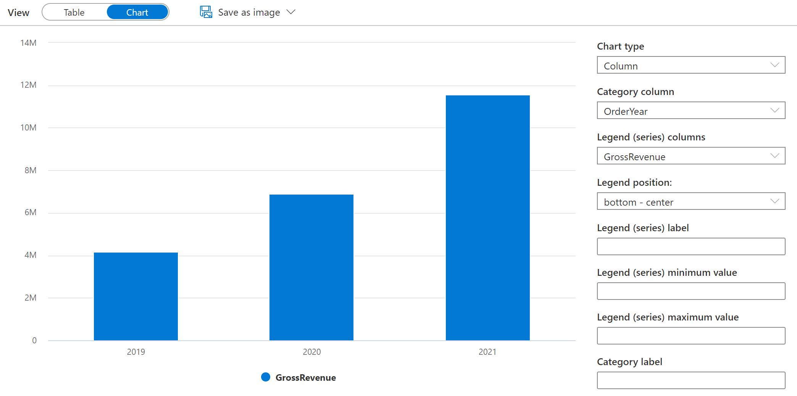

---
lab:
  title: Abfragen von Dateien mithilfe eines serverlosen SQL-Pools
  ilt-use: Lab
---

# Abfragen von Dateien mithilfe eines serverlosen SQL-Pools

SQL ist wahrscheinlich die am häufigsten verwendete Sprache für das Arbeiten mit Daten in der Welt. Die meisten Datenanalysten sind in der Verwendung von SQL-Abfragen zum Abrufen, Filtern und Aggregieren von Daten kompetent – am häufigsten in relationalen Datenbanken. Da Organisationen zunehmend die Vorteile der skalierbaren Dateispeicherung zum Erstellen von Data Lake nutzen, ist SQL häufig immer noch die bevorzugte Wahl für die Abfrage der Daten. Azure Synapse Analytics stellt serverlose SQL-Pools bereit, mit denen Sie das SQL-Abfragemodul vom Datenspeicher entkoppeln und Abfragen für Datendateien in gängigen Dateiformaten wie getrenntem Text und Parkett ausführen können.

Dieses Lab dauert ungefähr **40** Minuten.

## Vor der Installation

Sie benötigen ein [Azure-Abonnement](https://azure.microsoft.com/free), in dem Sie Administratorzugriff besitzen.

## Bereitstellen eines Azure Synapse Analytics-Arbeitsbereichs

Sie benötigen einen Azure Synapse Analytics-Arbeitsbereich mit Zugriff auf den Datenspeicher. Sie können den integrierten serverlosen SQL-Pool verwenden, um Dateien im Data Lake abzufragen.

In dieser Übung verwenden Sie eine Kombination aus einem PowerShell-Skript und einer ARM-Vorlage, um einen Azure Synapse Analytics-Arbeitsbereich bereitzustellen.

1. Melden Sie sich beim [Azure-Portal](https://portal.azure.com) unter `https://portal.azure.com` an.
2. Verwenden Sie rechts neben der Suchleiste oben auf der Seite die Schaltfläche **[\>_]**, um eine neue Cloud Shell-Instanz im Azure-Portal zu erstellen. Wählen Sie eine ***PowerShell***-Umgebung aus, und erstellen Sie Speicher, falls Sie dazu aufgefordert werden. Die Cloud Shell bietet eine Befehlszeilenschnittstelle in einem Bereich am unteren Rand des Azure-Portals, wie hier gezeigt:

    

    > **Hinweis**: Wenn Sie zuvor eine Cloud Shell erstellt haben, die eine *Bash*-Umgebung verwendet, ändern Sie diese mithilfe des Dropdownmenüs oben links im Cloud Shell-Bereich zu ***PowerShell***.

3. Beachten Sie, dass Sie die Größe der Cloud Shell durch Ziehen der Trennzeichenleiste oben im Bereich ändern können oder den Bereich mithilfe der Symbole **&#8212;**, **&#9723;** und **X** oben rechts minimieren, maximieren und schließen können. Weitere Informationen zur Verwendung von Azure Cloud Shell finden Sie in der [Azure Cloud Shell-Dokumentation](https://docs.microsoft.com/azure/cloud-shell/overview).

4. Geben Sie im PowerShell Bereich die folgenden Befehle ein, um dieses Repository zu klonen:

    ```
    rm -r dp203 -f
    git clone https://github.com/MicrosoftLearning/dp-203-azure-data-engineer dp203
    ```

5. Nachdem das Repository geklont wurde, geben Sie die folgenden Befehle ein, um in den Ordner für dieses Lab zu wechseln. Führen Sie das darin enthaltene Skript **setup.ps1** aus:

    ```
    cd dp203/Allfiles/labs/02
    ./setup.ps1
    ```

6. Wenn Sie dazu aufgefordert werden, wählen Sie aus, welches Abonnement Sie verwenden möchten (dies geschieht nur, wenn Sie Zugriff auf mehrere Azure-Abonnements haben).
7. Wenn Sie dazu aufgefordert werden, geben Sie ein geeignetes Kennwort ein, das für Ihren Azure Synapse SQL-Pool festgelegt werden soll.

    > **Hinweis**: Merken Sie sich unbedingt dieses Kennwort!

8. Warten Sie, bis das Skript abgeschlossen ist. Dies dauert in der Regel etwa 10 Minuten. Während Sie warten, lesen Sie den [Serverless SQL-Pool in Azure Synapse Analytics-Artikel](https://docs.microsoft.com/azure/synapse-analytics/sql/on-demand-workspace-overview) in der Dokumentation zu Azure Synapse Analytics.

## Abfragen von Daten in Dateien

Das Skript stellt einen Azure Synapse Analytics-Arbeitsbereich und ein Azure Storage-Konto zum Hosten des Data Lake bereit und lädt dann einige Dateien mit Daten in den Data Lake hoch.

### Anzeigen von Dateien im Data Lake

1. Wechseln Sie nach Abschluss des Skripts im Azure-Portal zur erstellten Ressourcengruppe **dp203-*xxxxxxx***, und wählen Sie Ihren Synapse-Arbeitsbereich aus.
2. Wählen Sie auf der Seite **Übersicht** für Ihren Synapse-Arbeitsbereich in der Karte **Synapse Studio öffnen** die Option **Öffnen** aus, um Synapse Studio in einer neuen Browserregisterkarte zu öffnen. Melden Sie sich an, wenn Sie dazu aufgefordert werden.
3. Verwenden Sie auf der linken Seite von Synapse Studio das Symbol **&rsaquo;&rsaquo;**, um das Menü zu erweitern. Dadurch werden die verschiedenen Seiten in Synapse Studio angezeigt, die Sie zum Verwalten von Ressourcen und zum Ausführen von Datenanalyseaufgaben verwenden.
4. Zeigen Sie auf der Seite **Daten** die Registerkarte **Verknüpft** an, und stellen Sie sicher, dass Ihr Arbeitsbereich einen Link zu Ihrem Azure Data Lake Storage Gen2-Speicherkonto enthält, dessen Name **synapse*xxxxxxx* (Primary - datalake*xxxxxxx*)** ähneln sollte.
5. Erweitern Sie Ihr Speicherkonto, und stellen Sie sicher, dass es einen Dateisystemcontainer mit dem Namen **Dateien** enthält.
6. Wählen Sie den Container **Dateien** aus und beachten Sie, dass er einen Ordner mit dem Namen **Sales** enthält. Dieser Ordner enthält die Datendateien, die Sie abfragen möchten.
7. Öffnen Sie den Ordner **Sales** und den darin enthaltenen **CSV**-Ordner und beachten Sie, dass dieser Ordner CSV-Dateien für drei Jahre Verkaufsdaten enthält.
8. Klicken Sie mit der rechten Maustaste auf eine der Dateien, und wählen Sie **Vorschau** aus, um die darin enthaltenen Daten anzuzeigen. Beachten Sie, dass die Dateien keine Kopfzeile enthalten, sodass Sie die Auswahl der Option zum Anzeigen von Spaltenüberschriften aufheben können.
9. Schließen Sie die Vorschau, und navigieren Sie dann mit der Schaltfläche **↑** zurück zum Ordner **Vertrieb**.
10. Öffnen Sie im Ordner **Vertrieb** den Ordner **JSON** , und beobachten Sie, dass er einige Beispielverkaufsaufträge in JSON-Dateien enthält. Zeigen Sie eine Vorschau dieser Dateien an, um das JSON-Format anzuzeigen, das für einen Verkaufsauftrag verwendet wird.
11. Schließen Sie die Vorschau, und navigieren Sie dann mit der Schaltfläche **↑** zurück zum Ordner **Vertrieb**.
12. Öffnen Sie im Ordner **Vertrieb** den Ordner **Parquet** , und stellen Sie fest, dass sie für jedes Jahr (2019-2021) einen Unterordner enthält, in dem jeweils eine Datei mit dem Namen **orders.snappy.parquet** die Bestelldaten für dieses Jahr enthält. 
13. Kehren Sie zum Ordner **sales** zurück, sodass Sie die Ordner **csv**, **json**, und **Parquet** sehen können.

### Verwenden von SQL zum Abfragen von CSV-Dateien

1. Wählen Sie den **CSV**-Ordner und dann in der Liste **Neues SQL-Skript** auf der Symbolleiste **Die ersten 100 Zeilen auswählen** aus.
2. In der **Dateityp** Liste wählen Sie **Textformat**, und wenden Sie dann die Einstellungen an, um ein neues SQL-Skript zu öffnen, das die Daten im Ordner abfragt.
3. Ändern Sie im Bereich **Eigenschaften**für **sql Script 1**, das erstellt wird, den Namen in **die CSV-Abfrage** ein", und ändern Sie die Ergebniseinstellungen, um ** alle Zeilen** anzuzeigen. Wählen Sie dann auf der Symbolleiste **Veröffentlichen** aus, um das Skript zu speichern, und verwenden Sie die Schaltfläche **Eigenschaften** aus (ähnlich  wie** .**) am rechten Ende der Symbolleiste, um den Bereich **Eigenschaften** auszublenden.
4. Überprüfen Sie den generierten SQL Code, der in etwa wie der folgende lauten sollte:

    ```SQL
    -- This is auto-generated code
    SELECT
        TOP 100 *
    FROM
        OPENROWSET(
            BULK 'https://datalakexxxxxxx.dfs.core.windows.net/files/sales/csv/',
            FORMAT = 'CSV',
            PARSER_VERSION='2.0'
        ) AS [result]
    ```

    Dieser Code verwendet das OPENROWSET zum Lesen von Daten aus den CSV-Dateien im Verkaufsordner und ruft die ersten 100 Datenzeilen ab.

5. Vergewissern Sie sich, dass in der Liste **Verbinden mit** die Option **Integriert** ausgewählt ist. Dies entspricht dem integrierten SQL-Pool, der mit Ihrem Arbeitsbereich erstellt wurde.
6. Verwenden Sie die Symbolleistenschaltfläche **&#9655; Ausführen**, um den SQL-Code auszuführen, und überprüfen Sie die Ergebnisse, die in etwa wie folgt aussehen sollten:

    | C1 | C2 | C3 | C4 | C5 | C6 | C7 | C8 | C9 |
    | -- | -- | -- | -- | -- | -- | -- | -- | -- |
    | SO45347 | 1 | 2020-01-01 | Clarence Raji | clarence35@adventure-works.com |Road-650 Black, 52 | 1 | 699.0982 | 55.9279 |
    | ... | ... | ... | ... | ... | ... | ... | ... | ... |

7. Beachten Sie, dass die Ergebnisse aus Spalten mit dem Namen C1, C2 usw. bestehen. In diesem Beispiel enthalten die CSV-Dateien nicht die Spaltenüberschriften. Obwohl es möglich ist, mit den Daten mithilfe der generischen Spaltennamen zu arbeiten, die zugewiesen wurden, oder nach Ordnungsposition, ist es einfacher, die Daten zu verstehen, wenn Sie ein tabellarisches Schema definieren. Fügen Sie hierzu eine WITH-Klausel zur OPENROWSET-Funktion hinzu (ersetzen Sie *datalakexxxxxxxxx* durch den Namen Ihres Datenspeicherkontos), und führen Sie dann die Abfrage erneut aus:

    ```SQL
    SELECT
        TOP 100 *
    FROM
        OPENROWSET(
            BULK 'https://datalakexxxxxxx.dfs.core.windows.net/files/sales/csv/',
            FORMAT = 'CSV',
            PARSER_VERSION='2.0'
        )
        WITH (
            SalesOrderNumber VARCHAR(10) COLLATE Latin1_General_100_BIN2_UTF8,
            SalesOrderLineNumber INT,
            OrderDate DATE,
            CustomerName VARCHAR(25) COLLATE Latin1_General_100_BIN2_UTF8,
            EmailAddress VARCHAR(50) COLLATE Latin1_General_100_BIN2_UTF8,
            Item VARCHAR(30) COLLATE Latin1_General_100_BIN2_UTF8,
            Quantity INT,
            UnitPrice DECIMAL(18,2),
            TaxAmount DECIMAL (18,2)
        ) AS [result]
    ```

    Die Ergebnisse sehen nun wie folgt aus:

    | SalesOrderNumber | SalesOrderLineNumber | OrderDate | CustomerName | EmailAddress | Element | Quantity (Menge) | UnitPrice (Stückpreis) | TaxAmount |
    | -- | -- | -- | -- | -- | -- | -- | -- | -- |
    | SO45347 | 1 | 2020-01-01 | Clarence Raji | clarence35@adventure-works.com |Road-650 Black, 52 | 1 | 699.10 | 55.93 |
    | ... | ... | ... | ... | ... | ... | ... | ... | ... |

8. Veröffentlichen Sie die Änderungen an Ihrem Skript, und schließen Sie dann den Skriptbereich.

### Verwenden von SQL zum Abfragen von Parquet-Dateien

Während CSV ein einfaches Format ist, ist es üblich, dass in Big Data-Verarbeitungsszenarien Dateiformate verwendet werden, die für Komprimierung, Indizierung und Partitionierung optimiert sind. Eines der am häufigsten verwendeten Formate ist *Parquet*.

1. Auf der Registerkarte **Dateien**, die das Dateisystem für Ihren Data Lake enthält, kehren Sie zurück zum Ordner **Vertrieb** sodass Sie die Ordner **csv**, **json**, und **Parquet** sehen können.
2. Wählen Sie den Ordner **Parquet**, und dann in der Liste **Neues SQL-Script** auf der Symbolleiste, **Obere 100 Zeilen auswählen**.
3. Wählen Sie in der Liste **Dateityp** aus, wählen **Parquet-Format**aus , und wenden Sie dann die Einstellungen an, um ein neues SQL-Skript zu öffnen, das die Daten im Ordner abfragt. Das Skript sollte ungefähr folgendermaßen aussehen:

    ```SQL
    -- This is auto-generated code
    SELECT
        TOP 100 *
    FROM
        OPENROWSET(
            BULK 'https://datalakexxxxxxx.dfs.core.windows.net/files/sales/parquet/**',
            FORMAT = 'PARQUET'
        ) AS [result]
    ```

4. Führen Sie den Code aus, und beachten Sie, dass sie Verkaufsauftragsdaten im selben Schema wie die csv-Dateien zurückgibt, die Sie zuvor untersucht haben. Die Schemainformationen werden in die Parquetdatei eingebettet, sodass die entsprechenden Spaltennamen in den Ergebnissen angezeigt werden.
5. Ändern Sie den Code wie folgt (Ersetzen Sie *datalakexxxxxxx* mit dem Namen Ihres Data Lake Speicherkontos) und führen ihn aus.

    ```sql
    SELECT YEAR(OrderDate) AS OrderYear,
           COUNT(*) AS OrderedItems
    FROM
        OPENROWSET(
            BULK 'https://datalakexxxxxxx.dfs.core.windows.net/files/sales/parquet/**',
            FORMAT = 'PARQUET'
        ) AS [result]
    GROUP BY YEAR(OrderDate)
    ORDER BY OrderYear
    ```

6. Beachten Sie, dass die Ergebnisse die Bestellanzahl für alle drei Jahre umfassen – die im BULK-Pfad verwendete Wild Karte bewirkt, dass die Abfrage Daten aus allen Unterordnern zurückgibt.

    Die Unterordner spiegeln *Partitionen* in den Parquetdaten wider, die häufig zur Optimierung der Leistung für Systeme verwendet werden, die mehrere Partitionen von Daten parallel verarbeiten können. Sie können auch Partitionen verwenden, um die Daten zu filtern.

7. Ändern Sie den Code wie folgt (Ersetzen Sie *datalakexxxxxxx* mit dem Namen Ihres Data Lake Speicherkontos) und führen ihn aus.

    ```sql
    SELECT YEAR(OrderDate) AS OrderYear,
           COUNT(*) AS OrderedItems
    FROM
        OPENROWSET(
            BULK 'https://datalakexxxxxxx.dfs.core.windows.net/files/sales/parquet/year=*/',
            FORMAT = 'PARQUET'
        ) AS [result]
    WHERE [result].filepath(1) IN ('2019', '2020')
    GROUP BY YEAR(OrderDate)
    ORDER BY OrderYear
    ```

8. Überprüfen Sie die Ergebnisse, und beachten Sie, dass sie nur die Verkaufszahlen für 2019 und 2020 enthalten. Diese Filterung wird erreicht, indem eine Wildcard für den Partitionsordnerwert im BULK-Pfad (*year=\**) und eine WHERE-Klausel basierend auf der *Dateipfad*-Eigenschaft der von OPENROWSET zurückgegebenen Ergebnisse eingeschlossen wird (in diesem Fall hat der Alias *[Result]*).

9. Benennen Sie Ihr Skript **Sales Parquet-Abfrage**, und veröffentlichen Sie es. Schließen Sie dann den Skriptbereich.

### Verwenden von SQL zum Abfragen von JSON-Dateien

JSON ist ein weiteres beliebtes Datenformat, es ist nützlich, um JSON-Dateien in einem serverlosen SQL-Pool abfragen zu können.

1. Kehren Sie auf der Registerkarte **Dateien**, die das Dateisystem für Ihren Data Lake enthält, zurück zum Ordner **Vertrieb**, sodass Sie die Ordner **csv**, **json** und **Parquet** sehen können.
2. Wählen Sie den **JSON-Ordner** aus, und wählen Sie dann in der Liste **dann in der **Neues SQL-Skript auf der Symbolleiste** Obere 100 Zeilen auswählen** aus.
3. In der **Dateityp** Liste wählen Sie **Textformat**, und wenden Sie dann die Einstellungen an, um ein neues SQL-Skript zu öffnen, das die Daten im Ordner abfragt. Das Skript sollte ungefähr folgendermaßen aussehen:

    ```sql
    -- This is auto-generated code
    SELECT
        TOP 100 *
    FROM
        OPENROWSET(
            BULK 'https://datalakexxxxxxx.dfs.core.windows.net/files/sales/json/',
            FORMAT = 'CSV',
            PARSER_VERSION = '2.0'
        ) AS [result]
    ```

    Das Skript ist so konzipiert, dass kommagetrennte (CSV)-Daten abgefragt werden, anstatt JSON abzufragen. Daher müssen Sie einige Änderungen vornehmen, bevor sie erfolgreich funktionieren.

4. Ändern Sie das Skript wie folgt (Ersetzen Sie *datalakexxxxxxx* durch die Namen Ihres Data Lake-Speicherkontos und Dateisystems):
    - Entfernen Sie den Parserversionsparameter.
    - Fügen Sie Parameter für Feldterminatoren, an zitierte Felder und Zeilenbeendzeichen hinzu, wobei der Zeichencode *0x0b*.
    - Formatieren Sie die Ergebnisse als einzelnes Feld, das die JSON-Datenzeile als NVARCHAR(MAX)-Zeichenfolge enthält.

    ```sql
    SELECT
        TOP 100 *
    FROM
        OPENROWSET(
            BULK 'https://datalakexxxxxxx.dfs.core.windows.net/files/sales/json/',
            FORMAT = 'CSV',
            FIELDTERMINATOR ='0x0b',
            FIELDQUOTE = '0x0b',
            ROWTERMINATOR = '0x0b'
        ) WITH (Doc NVARCHAR(MAX)) as rows
    ```

5. Führen Sie den geänderten Code aus, und beachten Sie, dass die Ergebnisse für jede Reihenfolge ein JSON-Dokument enthalten.

6. Ändern Sie die Abfrage wie folgt (ersetzen Sie *datalakexxxxxxxxx* durch den Namen Ihres Datenspeicherkontos), sodass die JSON_VALUE-Funktion verwendet wird, um einzelne Feldwerte aus den JSON-Daten zu extrahieren.

    ```sql
    SELECT JSON_VALUE(Doc, '$.SalesOrderNumber') AS OrderNumber,
           JSON_VALUE(Doc, '$.CustomerName') AS Customer,
           Doc
    FROM
        OPENROWSET(
            BULK 'https://datalakexxxxxxx.dfs.core.windows.net/files/sales/json/',
            FORMAT = 'CSV',
            FIELDTERMINATOR ='0x0b',
            FIELDQUOTE = '0x0b',
            ROWTERMINATOR = '0x0b'
        ) WITH (Doc NVARCHAR(MAX)) as rows
    ```

7. Benennen Sie Ihr Skript**Vertrieb JSON Abfrage ** und veröffentlichen Sie sie. Schließen Sie dann den Skriptbereich.

## Zugreifen auf externe Daten in einer Datenbank

Bisher haben Sie die OPENROWSET-Funktion in einer SELECT-Abfrage verwendet, um Daten aus Dateien in einem Data Lake abzurufen. Die Abfragen wurden im Kontext der **Masterdatenbank** in Ihrem serverlosen SQL-Pool ausgeführt. Dieser Ansatz eignet sich für eine anfängliche Erkundung der Daten, aber wenn Sie beabsichtigen, komplexere Abfragen zu erstellen, ist es möglicherweise effektiver, die *PolyBase-Funktion* von Synapse SQL zum Erstellen von Objekten in einer Datenbank zu verwenden, die auf den externen Datenspeicherort verweisen.

### Erstellen einer externen Datenquelle

Indem Sie eine externe Datenquelle in einer Datenbank definieren, können Sie sie verwenden, um auf den Datenspeicherort zu verweisen, an dem die Dateien gespeichert sind.

1. Wählen Sie in Synapse Studio auf der Seite  **Entwickeln**, im **+**-Menü das **SQL-Skript** aus.
2. Fügen Sie im neuen Skriptbereich den folgenden Code hinzu (ersetzen Sie *datalakexxxxxxxxx* durch den Namen Ihres Data Lake-Speicherkontos), um eine neue Datenbank zu erstellen und eine externe Datenquelle hinzuzufügen.

    ```sql
    CREATE DATABASE Sales
      COLLATE Latin1_General_100_BIN2_UTF8;
    GO;

    Use Sales;
    GO;

    CREATE EXTERNAL DATA SOURCE sales_data WITH (
        LOCATION = 'https://datalakexxxxxxx.dfs.core.windows.net/files/sales/'
    );
    GO;
    ```

3. Ändern Sie die Skripteigenschaften, um ihren Namen in **Sales DB erstellen** zu ändern und zu veröffentlichen.
4. Stellen Sie sicher, dass das Skript mit dem **integrierten** SQL-Pool und der Datenbank **Master** verbunden ist, und führen Sie es dann aus.
5. Wechseln Sie zurück zur Seite **Daten**, und verwenden Sie die Schaltfläche **&#8635;** oben rechts in Synapse Studio, um die Seite zu aktualisieren. Zeigen Sie dann die Registerkarte **Arbeitsbereich** im Bereich **Daten** an, wo jetzt eine Liste **SQL-Datenbank** angezeigt wird. Erweitern Sie diese Liste, um zu überprüfen, ob die Datenbank **Sales** erstellt wurde.
6. Erweitern Sie die **Vertriebsdatenbank** , den Ordner **Externe Ressource**und den Ordner **Externe Datenquellen** , um die **sales_data** von Ihnen erstellten externen Datenquelle anzuzeigen.
7. Wählen Sie im **...** Menü für die Datenbank **Vertrieb** Folgendes aus **Neues SQL-Skript** > **Leeres Skript**. Geben Sie dann im neuen Skriptbereich die folgende Abfrage ein, und führen Sie sie aus:

    ```sql
    SELECT *
    FROM
        OPENROWSET(
            BULK 'csv/*.csv',
            DATA_SOURCE = 'sales_data',
            FORMAT = 'CSV',
            PARSER_VERSION = '2.0'
        ) AS orders
    ```

    Die Abfrage verwendet die externe Datenquelle, um eine Verbindung mit dem Data Lake herzustellen, und die OPENROWSET-Funktion muss jetzt nur auf den relativen Pfad zu den CSV-Dateien verweisen.

8. Ändern Sie den Code wie folgt, um die Parquetdateien mithilfe der Datenquelle abzufragen.

    ```sql
    SELECT *
    FROM  
        OPENROWSET(
            BULK 'parquet/year=*/*.snappy.parquet',
            DATA_SOURCE = 'sales_data',
            FORMAT='PARQUET'
        ) AS orders
    WHERE orders.filepath(1) = '2019'
    ```

### Erstellen einer externen Tabelle

Die externe Datenquelle erleichtert den Zugriff auf die Dateien im Data Lake, aber die meisten Datenanalysten, die SQL verwenden, werden zum Arbeiten mit Tabellen in einer Datenbank verwendet. Glücklicherweise können Sie auch externe Dateiformate und externe Tabellen definieren, die Rowsets aus Dateien in Datenbanktabellen kapseln.

1. Ersetzen Sie den SQL-Code durch die folgende Anweisung, um ein externes Datenformat für CSV-Dateien zu definieren, und eine externe Tabelle, die auf die CSV-Dateien verweist, und führen Sie es aus:

    ```sql
    CREATE EXTERNAL FILE FORMAT CsvFormat
        WITH (
            FORMAT_TYPE = DELIMITEDTEXT,
            FORMAT_OPTIONS(
            FIELD_TERMINATOR = ',',
            STRING_DELIMITER = '"'
            )
        );
    GO;

    CREATE EXTERNAL TABLE dbo.orders
    (
        SalesOrderNumber VARCHAR(10),
        SalesOrderLineNumber INT,
        OrderDate DATE,
        CustomerName VARCHAR(25),
        EmailAddress VARCHAR(50),
        Item VARCHAR(30),
        Quantity INT,
        UnitPrice DECIMAL(18,2),
        TaxAmount DECIMAL (18,2)
    )
    WITH
    (
        DATA_SOURCE =sales_data,
        LOCATION = 'csv/*.csv',
        FILE_FORMAT = CsvFormat
    );
    GO
    ```

2. Aktualisieren und erweitern Sie den Ordner **Externe Tabellen** im Bereich **Daten** und bestätigen Sie, dass eine Tabelle mit Namen **dbo.orders** in der Datenbank **Vertrieb** erstellt wurde.
3. Wählen Sie im Menü **...** für die Tabelle **dbo.orders**  **Neues SQL-Skript** > **aus. Wählen Sie Obere 100 Zeilen**.
4. Führen Sie das SELECT-Skript aus, das generiert wurde, und stellen Sie sicher, dass es die ersten 100 Datenzeilen aus der Tabelle abruft, die wiederum auf die Dateien im Data Lake verweist.

    >**Hinweis:** Sie sollten immer die Methode auswählen, die ihren spezifischen Anforderungen und Anwendungsfall am besten entspricht. Ausführlichere Informationen finden Sie in den Artikeln [Verwendung von OPENROWSET mithilfe des serverlosen SQL-Pools in Azure Synapse Analytics](https://learn.microsoft.com/en-us/azure/synapse-analytics/sql/develop-openrowset) und [Zugreifen auf externen Speicher mithilfe des serverlosen SQL-Pools in Azure Synapse Analytics](https://learn.microsoft.com/en-us/azure/synapse-analytics/sql/develop-storage-files-overview?tabs=impersonation) .

## Visualisieren von Abfrageergebnissen

Nachdem Sie nun verschiedene Möglichkeiten zum Abfragen von Dateien im Data Lake mithilfe von SQL-Abfragen untersucht haben, können Sie die Ergebnisse dieser Abfragen analysieren, um Einblicke in die Daten zu erhalten. Häufig können Erkenntnisse leichter aufgedeckt werden, indem die Abfrageergebnisse in einem Diagramm visualisiert werden; die Sie ganz einfach mithilfe der integrierten Diagrammfunktionen im Synapse Studio-Abfrage-Editor ausführen können.

1. Erstellen Sie auf der Seite **Entwickeln"** eine neue leere SQL-Abfrage.
2. Stellen Sie sicher, dass das Skript mit dem integrierten **SQL-Pool** und der **Vertriebsdatenbank** verbunden ist.
3. Bearbeiten Sie den folgenden SQL-Code, und führen Sie ihn aus.

    ```sql
    SELECT YEAR(OrderDate) AS OrderYear,
           SUM((UnitPrice * Quantity) + TaxAmount) AS GrossRevenue
    FROM dbo.orders
    GROUP BY YEAR(OrderDate)
    ORDER BY OrderYear;
    ```

4. Wählen Sie im Bereic **Ergebnisse** ** Diagramm **aus und zeigen das Diagramm an, das für Sie erstellt wird. Dabei sollte es sich um ein Liniendiagramm handelt.
5. Ändern Sie die Spalte **Kategorie** in **Bestelljahr** ", sodass das Liniendiagramm den Umsatztrend im dreijährigen Zeitraum von 2019 bis 2021 anzeigt:

    

6. Wechseln Sie den **Diagrammtyp** in **Spalte ** um den jahresmäßigen Umsatz als Säulendiagramm anzuzeigen:

    

7. Experimentieren Sie mit der Diagrammfunktionalität  im Abfrage-Editor. Sie bietet einige grundlegende Diagrammfunktionen, die Sie verwenden können, während Sie Daten interaktiv untersuchen, und Sie können Diagramme als Bilder speichern, um sie in Berichte einzuschließen. Die Funktionalität ist jedoch im Vergleich zu Tools zur Unternehmensdatenvisualisierung wie Microsoft Power BI beschränkt.

## Löschen von Azure-Ressourcen

Wenn Sie sich mit Azure Synapse Analytics vertraut gemacht haben, sollten Sie die erstellten Ressourcen löschen, um unnötige Azure-Kosten zu vermeiden.

1. Schließen Sie die Registerkarte mit Synapse Studio, und kehren Sie zum Azure-Portal zurück.
2. Wählen Sie auf der **Startseite** des Azure-Portals die Option **Ressourcengruppen** aus.
3. Wählen Sie die Ressourcengruppe **dp203-*xxxxxxx*** für Ihren Synapse Analytics-Arbeitsbereich aus (nicht die verwaltete Ressourcengruppe), und vergewissern Sie sich, dass sie den Synapse-Arbeitsbereich und das Speicherkonto für Ihren Arbeitsbereich enthält.
4. Wählen Sie oben auf der Seite **Übersicht** für Ihre Ressourcengruppe die Option **Ressourcengruppe löschen** aus.
5. Geben Sie den Namen der Ressourcengruppe **dp203-*xxxxxxx*** ein, um zu bestätigen, dass Sie sie löschen möchten, und wählen Sie **Löschen** aus.

    Nach einigen Minuten werden die Ressourcengruppe in Ihrem Azure Synapse-Arbeitsbereich und die damit verknüpfte Ressourcengruppe im verwalteten Arbeitsbereich gelöscht.