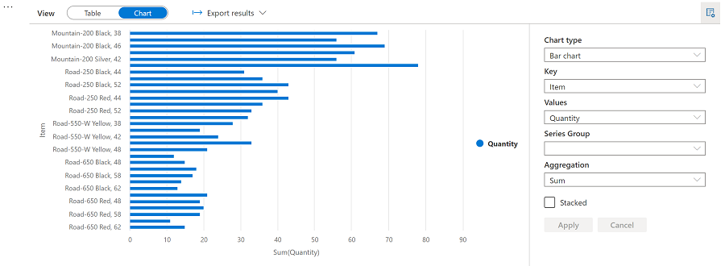

---
lab:
  title: Analysieren von Daten in einem Data Lake mit Spark
  module: 'Model, query, and explore data in Azure Synapse'
---

# Analysieren von Daten in einem Data Lake mit Spark

Apache Spark ist eine Open-Source-Engine für verteilte Datenverarbeitung und wird häufig verwendet, um große Datenmengen in Data Lake Storage zu untersuchen, zu verarbeiten und zu analysieren. Spark ist als Verarbeitungsoption in vielen Datenplattformprodukten verfügbar, einschließlich in Azure HDInsight, Azure Databricks und Azure Synapse Analytics auf der Microsoft Azure-Cloudplattform. Einer der Vorteile von Spark ist die Unterstützung für eine Vielzahl von Programmiersprachen (einschließlich Java, Scala, Python und SQL). Dies macht Spark zu einer sehr flexiblen Lösung für Datenverarbeitungsworkloads (einschließlich Datenbereinigung und -manipulation, statistischer Analysen, maschinellem Lernen, Datenanalysen und Visualisierungen).

Dieses Lab dauert ungefähr **45** Minuten.

## Vor der Installation

Sie benötigen ein [Azure-Abonnement](https://azure.microsoft.com/free), in dem Sie Administratorzugriff besitzen.

## Bereitstellen eines Azure Synapse Analytics-Arbeitsbereichs

Sie benötigen einen Azure Synapse Analytics-Arbeitsbereich mit Zugriff auf den Datenspeicher und einen Apache Spark-Pool, den Sie zum Abfragen und Verarbeiten von Dateien im Data Lake verwenden können.

In dieser Übung verwenden Sie eine Kombination aus einem PowerShell-Skript und einer ARM-Vorlage, um einen Azure Synapse Analytics-Arbeitsbereich bereitzustellen.

1. Melden Sie sich beim [Azure-Portal](https://portal.azure.com) unter `https://portal.azure.com` an.
2. Verwenden Sie rechts neben der Suchleiste oben auf der Seite die Schaltfläche **[\>_]**, um eine neue Cloud Shell-Instanz im Azure-Portal zu erstellen. Wählen Sie eine ***PowerShell***-Umgebung aus, und erstellen Sie Speicher, falls Sie dazu aufgefordert werden. Die Cloud Shell bietet eine Befehlszeilenschnittstelle in einem Bereich am unteren Rand des Azure-Portals, wie hier gezeigt:

    

    > **Hinweis**: Wenn Sie zuvor eine Cloud Shell erstellt haben, die eine *Bash*-Umgebung verwendet, ändern Sie diese mithilfe des Dropdownmenüs oben links im Cloud Shell-Bereich zu ***PowerShell***.

3. Beachten Sie, dass Sie die Größe der Cloud Shell durch Ziehen der Trennzeichenleiste oben im Bereich ändern können oder den Bereich mithilfe der Symbole **&#8212;**, **&#9723;** und **X** oben rechts minimieren, maximieren und schließen können. Weitere Informationen zur Verwendung von Azure Cloud Shell finden Sie in der [Azure Cloud Shell-Dokumentation](https://docs.microsoft.com/azure/cloud-shell/overview).

4. Geben Sie im PowerShell-Bereich die folgenden Befehle ein, um dieses Repository zu klonen:

    ```
    rm -r dp203 -f
    git clone https://github.com/MicrosoftLearning/DP-203-Azure-Data-Engineer dp203
    ```

5. Nachdem das Repository geklont wurde, geben Sie die folgenden Befehle ein, um in den Ordner für dieses Lab zu wechseln. Führen Sie das darin enthaltene Skript **setup.ps1** aus:

    ```
    cd dp203/Allfiles/labs/02
    ./setup.ps1
    ```

6. Wenn Sie dazu aufgefordert werden, wählen Sie aus, welches Abonnement Sie verwenden möchten (dies geschieht nur, wenn Sie Zugriff auf mehrere Azure-Abonnements haben).
7. Wenn Sie dazu aufgefordert werden, geben Sie ein geeignetes Kennwort ein, das für Ihren Azure Synapse SQL-Pool festgelegt werden soll.

    > **Hinweis**: Merken Sie sich unbedingt dieses Kennwort!

8. Warten Sie, bis das Skript abgeschlossen ist. Dies dauert in der Regel etwa 10 Minuten und in Ausnahmefällen auch länger. Während Sie warten, können Sie den Artikel [Apache Spark in Azure Synapse Analytics](https://docs.microsoft.com/azure/synapse-analytics/spark/apache-spark-overview) in der Dokumentation zu Azure Synapse Analytics lesen.

## Abfragen von Daten in Dateien

Das Skript stellt einen Azure Synapse Analytics-Arbeitsbereich und ein Azure Storage-Konto zum Hosten des Data Lake bereit und lädt dann einige Dateien mit Daten in den Data Lake hoch.

### Anzeigen von Dateien im Data Lake

1. Wechseln Sie nach Abschluss des Skripts im Azure-Portal zur  Ressourcengruppe**dp500-*xxxxx*** und wählen Sie ihren Synapse-Arbeitsbereich aus.
2. Wählen Sie auf der Seite **Übersicht** für Ihren Synapse-Arbeitsbereich auf der Karte **Open Synapse Studio** die Option**Öffnen** aus, um Synapse Studio auf einer neuen Browserregisterkarte zu öffnen.
3. Verwenden Sie auf der linken Seite von Synapse Studio das Symbol **&rsaquo;&rsaquo;**, um das Menü zu erweitern. Dadurch werden die verschiedenen Seiten in Synapse Studio angezeigt, die Sie zum Verwalten von Ressourcen und zum Ausführen von Datenanalyseaufgaben verwenden.
4. Wählen Sie auf der Seite **Verwalten** die Registerkarte **Apache Spark Pools** aus und beachten Sie, dass ein Spark-Pool mit einem Namen der Form **spark*xxxxxxx*** im Arbeitsbereich bereitgestellt wurde. Später verwenden Sie diesen Spark-Pool, um Daten aus Dateien im Data Lake-Speicher für den Arbeitsbereich zu laden und zu analysieren.
5. Zeigen Sie auf der Seite **Daten** die Registerkarte **Verknüpft** an, und stellen Sie sicher, dass Ihr Arbeitsbereich einen Link zu Ihrem Azure Data Lake Storage Gen2-Speicherkonto enthält, dessen Name **synapse*xxxxxxx* (Primary - datalake*xxxxxxx*)** ähneln sollte.
6. Erweitern Sie Ihr Speicherkonto, und stellen Sie sicher, dass es einen Dateisystemcontainer mit dem Namen **Dateien** enthält.
7. Wählen Sie den **files**-Container aus, und beachten Sie, dass er Ordner mit den Namen **sales** und **synapse** enthält. Der Ordner **synapse** wird von Azure Synapse verwendet, und der Ordner **sales** enthält die Datendateien, die Sie abfragen möchten.
8. Öffnen Sie den Ordner **sales** und den Ordner **orders**, der darin enthalten ist, und beachten Sie, dass der Ordner **orders** CSV-Dateien mit Verkaufsdaten von drei Jahren enthält.
9. Klicken Sie mit der rechten Maustaste auf eine der Dateien, und wählen Sie **Vorschau** aus, um die darin enthaltenen Daten anzuzeigen. Beachten Sie, dass die Dateien keine Kopfzeile enthalten, sodass Sie die Auswahl der Option zum Anzeigen von Spaltenüberschriften aufheben können.

### Verwenden von Spark zum Untersuchen von Daten

1. Wählen Sie eine der Dateien im Ordner **orders** aus, und wählen Sie dann in der Liste **Neues Notebook** auf der Symbolleiste **In DataFrame laden** aus. Ein Dataframe ist eine Struktur in Spark, die ein tabellarisches Dataset darstellt.
2. Wählen Sie auf der neuen Registerkarte **Notebook 1**, die geöffnet wird, in der Liste **Anfügen an** Ihren Spark-Pool (**spark*xxxxxxx***) aus. Verwenden Sie dann die Schaltfläche **&#9655; Alle ausführen**, um alle Zellen im Notebook auszuführen (derzeit ist nur eine vorhanden!).

    Da Sie Spark-Code zum ersten Mal in dieser Sitzung ausführen, muss der Spark-Pool gestartet werden. Dies bedeutet, dass die erste Ausführung in der Sitzung ein paar Minuten dauern kann. Nachfolgende Ausführungen erfolgen schneller.

3. Während Sie auf die Initialisierung der Spark-Sitzung warten, überprüfen Sie den generierten Code, der Folgendem ähnlich sieht:

    ```Python
    %%pyspark
    df = spark.read.load('abfss://files@datalakexxxxxxx.dfs.core.windows.net/sales/orders/2019.csv', format='csv'
    ## If header exists uncomment line below
    ##, header=True
    )
    display(df.limit(10))
    ```

4. Wenn der Code ausgeführt wurde, überprüfen Sie die Ausgabe unter der Zelle im Notebook. Sie zeigt die ersten zehn Zeilen in der ausgewählten Datei mit automatischen Spaltennamen im Format **_c0**, **_c1**, **_c2** usw. an.
5. Ändern Sie den Code so, dass die **spark.read.load**-Funktion Daten aus <u>allen</u> CSV-Dateien im Ordner liest und die **display**-Funktion die ersten 100 Zeilen anzeigt. Ihr Code sollte wie folgt aussehen und *datalakexxxxx* dem Namen Ihres Data Lake-Speichers entsprechen:

    ```Python
    %%pyspark
    df = spark.read.load('abfss://files@datalakexxxxxxx.dfs.core.windows.net/sales/orders/*.csv', format='csv'
    )
    display(df.limit(100))
    ```

6. Verwenden Sie die Schaltfläche **&#9655;** links neben der Codezelle aus, um nur diese Zelle auszuführen, und überprüfen Sie die Ergebnisse.

    Der Dataframe enthält jetzt Daten aus allen Dateien, aber die Spaltennamen sind nicht hilfreich. Spark verwendet einen "Schema-beim-Lesen"-Ansatz, um geeignete Datentypen für die Spalten basierend auf den darin enthaltenen Daten zu ermitteln. Wenn eine Kopfzeile in einer Textdatei vorhanden ist, kann sie verwendet werden, um die Spaltennamen zu identifizieren, indem ein **header=True**-Parameter in der **load**-Funktion angegeben wird. Alternativ können Sie ein explizites Schema für den Dataframe definieren.

7. Ändern Sie den Code wie folgt, und ersetzen Sie *datalakexxxxxxxxx*, um ein explizites Schema für den Dataframe zu definieren, der die Spaltennamen und Datentypen enthält. Führen Sie den Code in der Zelle erneut aus.

    ```Python
    %%pyspark
    from pyspark.sql.types import *
    from pyspark.sql.functions import *

    orderSchema = StructType([
        StructField("SalesOrderNumber", StringType()),
        StructField("SalesOrderLineNumber", IntegerType()),
        StructField("OrderDate", DateType()),
        StructField("CustomerName", StringType()),
        StructField("Email", StringType()),
        StructField("Item", StringType()),
        StructField("Quantity", IntegerType()),
        StructField("UnitPrice", FloatType()),
        StructField("Tax", FloatType())
        ])

    df = spark.read.load('abfss://files@datalakexxxxxxx.dfs.core.windows.net/sales/orders/*.csv', format='csv', schema=orderSchema)
    display(df.limit(100))
    ```

8. Verwenden Sie in den Ergebnissen die Schaltfläche **+ Code**, um dem Notebook eine neue Codezelle hinzuzufügen. Fügen Sie dann in der neuen Zelle den folgenden Code hinzu, um das Dataframeschema anzuzeigen:

    ```Python
    df.printSchema()
    ```

9. Führen Sie die neue Zelle aus, und stellen Sie sicher, dass das Dataframeschema dem von Ihnen definierten **orderSchema** entspricht. Die **printSchema**-Funktion kann nützlich sein, wenn ein Dataframe mit einem automatisch abgeleiteten Schema verwendet wird.

## Analysieren von Daten in einem Dataframe

Das **dataframe**-Objekt in Spark ähnelt einem Pandas-Dataframe in Python und enthält eine Vielzahl von Funktionen, mit denen Sie die darin enthaltenen Daten bearbeiten, filtern, gruppieren und auf weitere Arten analysieren können.

### Filtern eines Dataframes

1. Fügen Sie dem Notebook eine neue Codezelle hinzu, und geben Sie darin den folgenden Code ein:

    ```Python
    customers = df['CustomerName', 'Email']
    print(customers.count())
    print(customers.distinct().count())
    display(customers.distinct())
    ```

2. Führen Sie die neue Codezelle aus, und überprüfen Sie die Ergebnisse. Beachten Sie die folgenden Details:
    - Wenn Sie einen Vorgang für einen Dataframe ausführen, ist das Ergebnis ein neuer Dataframe (in diesem Fall wird ein neuer **customers**-Dataframe erstellt, indem eine bestimmte Teilmenge von Spalten aus dem **df**-Dataframe ausgewählt wird).
    - Dataframes bieten Funktionen wie **count** und **distinct**, die zum Zusammenfassen und Filtern der darin enthaltenen Daten verwendet werden können.
    - Die Syntax `dataframe['Field1', 'Field2', ...]` ist eine Kurzform für die Definition einer Teilmenge von Spalten. Sie können auch die **select**-Methode verwenden, sodass die erste Zeile des obigen Codes wie folgt geschrieben werden kann: `customers = df.select("CustomerName", "Email")`.

3. Ändern Sie den Code wie folgt:

    ```Python
    customers = df.select("CustomerName", "Email").where(df['Item']=='Road-250 Red, 52')
    print(customers.count())
    print(customers.distinct().count())
    display(customers.distinct())
    ```

4. Führen Sie den geänderten Code aus, um die Kunden anzuzeigen, die das Produkt *Road-250 Red, 52* erworben haben. Beachten Sie, dass Sie mehrere Funktionen verketten können, sodass die Ausgabe einer Funktion zur Eingabe für die nächste wird. In diesem Fall ist der von der **select**-Methode erstellte Dataframe der Quelldataframe für die **where**-Methode, die zum Anwenden von Filterkriterien verwendet wird.

### Aggregieren und Gruppieren von Daten in einem Dataframe

1. Fügen Sie dem Notebook eine neue Codezelle hinzu, und geben Sie darin den folgenden Code ein:

    ```Python
    productSales = df.select("Item", "Quantity").groupBy("Item").sum()
    display(productSales)
    ```

2. Führen Sie die hinzugefügte Codezelle aus, und beachten Sie, dass in den Ergebnissen die Summe der Bestellmengen nach Produkt gruppiert angezeigt wird. Die **groupBy**-Methode gruppiert die Zeilen nach *Item*, und die nachfolgende **sum**-Aggregatfunktion wird auf alle verbleibenden numerischen Spalten angewendet (in diesem Fall *Quantity*).

3. Fügen Sie dem Notebook eine weitere Codezelle hinzu, und geben Sie darin den folgenden Code ein:

    ```Python
    yearlySales = df.select(year("OrderDate").alias("Year")).groupBy("Year").count().orderBy("Year")
    display(yearlySales)
    ```

4. Führen Sie die hinzugefügte Codezelle aus, und beachten Sie, dass in den Ergebnissen die Anzahl der Verkaufsaufträge pro Jahr angezeigt wird. Beachten Sie, dass die **select**-Methode eine SQL-Funktion **year** enthält, um die Jahreskomponente des Felds *OrderDate* zu extrahieren. Anschließend wird eine **alias**-Methode verwendet, um dem extrahierten Jahreswert einen Spaltennamen zuzuweisen. Die Daten werden dann nach der abgeleiteten *Year*-Spalte gruppiert, und die Anzahl der Zeilen in jeder Gruppe wird berechnet, bevor schließlich die **orderBy**-Methode verwendet wird, um den resultierenden Dataframe zu sortieren.

## Abfragen von Daten mithilfe von Spark SQL

Wie Sie gesehen haben, ermöglichen Ihnen die nativen Methoden des Dataframeobjekts, Daten aus einer Datei effektiv abzufragen und zu analysieren. Viele Datenanalysten arbeiten jedoch lieber mit SQL-Syntax. Spark SQL ist eine SQL-Sprach-API in Spark, die Sie verwenden können, um SQL-Anweisungen auszuführen oder sogar um Daten in relationalen Tabellen zu speichern.

### Verwenden von Spark SQL im PySpark-Code

Die Standardsprache in Azure Synapse Studio-Notebooks ist PySpark, eine Spark-basierte Python-Runtime. Innerhalb dieser Runtime können Sie die **spark.sql**-Bibliothek verwenden, um Spark SQL-Syntax in Ihren Python-Code einzubetten und mit SQL-Konstrukten wie Tabellen und Ansichten arbeiten.

1. Fügen Sie dem Notebook eine neue Codezelle hinzu, und geben Sie darin den folgenden Code ein:

    ```Python
    df.createOrReplaceTempView("salesorders")

    spark_df = spark.sql("SELECT * FROM salesorders")
    display(spark_df)
    ```

2. Führen Sie die Zelle aus, und überprüfen Sie die Ergebnisse. Beachten Sie, Folgendes:
    - Der Code speichert die Daten im **df**-Dataframe als temporäre Ansicht mit dem Namen **salesorders**. Spark SQL unterstützt die Verwendung temporärer Ansichten oder beibehaltener Tabellen als Quellen für SQL-Abfragen.
    - Die **spark.sql**-Methode wird dann verwendet, um eine SQL-Abfrage für die **salesorders**-Ansicht auszuführen.
    - Die Ergebnisse der Abfrage werden in einem Dataframe gespeichert.

### Ausführen von SQL-Code in einer Zelle

Obwohl es nützlich ist, SQL-Anweisungen in eine Zelle einzubetten, die PySpark-Code enthält, bevorzugen Data Analysts oft die Arbeit direkt in SQL.

1. Fügen Sie dem Notebook eine neue Codezelle hinzu, und geben Sie darin den folgenden Code ein:

    ```sql
    %%sql
    SELECT YEAR(OrderDate) AS OrderYear,
           SUM((UnitPrice * Quantity) + Tax) AS GrossRevenue
    FROM salesorders
    GROUP BY YEAR(OrderDate)
    ORDER BY OrderYear;
    ```

2. Führen Sie die Zelle aus, und überprüfen Sie die Ergebnisse. Beachten Sie, Folgendes:
    - Die Zeile `%%sql` am Anfang der Zelle (wird als *Magic-Befehl* bezeichnet) gibt an, dass anstelle von PySpark die Spark SQL-Runtime verwendet werden soll, um den Code in dieser Zelle auszuführen.
    - Der SQL-Code verweist auf die Ansicht **salesorders**, die Sie zuvor mit PySpark erstellt haben.
    - Die Ausgabe der SQL-Abfrage wird automatisch als Ergebnis unter der Zelle angezeigt.

> **Hinweis:** Weitere Informationen zu Spark SQL und Dataframes finden Sie in der [Spark SQL-Dokumentation](https://spark.apache.org/docs/2.2.0/sql-programming-guide.html).

## Visualisieren von Daten mit Spark

Ein Bild sagt sprichwörtlich mehr als tausend Worte, und ein Diagramm ist oft besser als tausend Datenzeilen. Notebooks in Azure Synapse Analytics enthalten zwar eine integrierte Diagrammansicht für Daten, die aus einem Dataframe oder einer Spark SQL-Abfrage angezeigt werden, jedoch ist sie nicht für die umfassende Diagrammdarstellung konzipiert. Sie können jedoch Python-Grafikbibliotheken wie **matplotlib** und **seaborn** verwenden, um Diagramme aus Daten in Dataframes zu erstellen.

### Anzeigen von Ergebnissen als Diagramm

1. Fügen Sie dem Notebook eine neue Codezelle hinzu, und geben Sie darin den folgenden Code ein:

    ```sql
    %%sql
    SELECT * FROM salesorders
    ```

2. Führen Sie den Code aus, und beachten Sie, dass er die Daten aus der **salesorders**-Ansicht zurückgibt, die Sie zuvor erstellt haben.
3. Ändern Sie im Ergebnisabschnitt unterhalb der Zelle die Option **Ansicht** von **Tabelle** in **Diagramm**.
4. Verwenden Sie die Schaltfläche **Ansichtsoptionen** oben rechts im Diagramm, um den Optionsbereich für das Diagramm anzuzeigen. Legen Sie dann die Optionen wie folgt fest, und klicken Sie auf **Anwenden**:
    - **Diagrammtyp:** Balkendiagramm
    - **Schlüssel:** Element
    - **Werte:** Menge
    - **Reihengruppe:** *Leer lassen*
    - **Aggregation:** Summe
    - **Gestapelt:** *Nicht aktiviert*

5. Stellen Sie sicher, dass das Diagramm in etwa wie folgt aussieht:

    

### Erste Schritte mit **matplotlib**

1. Fügen Sie dem Notebook eine neue Codezelle hinzu, und geben Sie darin den folgenden Code ein:

    ```Python
    sqlQuery = "SELECT CAST(YEAR(OrderDate) AS CHAR(4)) AS OrderYear, \
                    SUM((UnitPrice * Quantity) + Tax) AS GrossRevenue \
                FROM salesorders \
                GROUP BY CAST(YEAR(OrderDate) AS CHAR(4)) \
                ORDER BY OrderYear"
    df_spark = spark.sql(sqlQuery)
    df_spark.show()
    ```

2. Führen Sie den Code aus, und überprüfen Sie, ob ein Spark-Dataframe mit dem Jahresumsatz zurückgegeben wird.

    Um die Daten als Diagramm zu visualisieren, verwenden Sie zunächst die Python-Bibliothek **matplotlib**. Diese Bibliothek ist die zentrale Bibliothek für Darstellungen, auf der viele andere basieren, und sie bietet hohe Flexibilität beim Erstellen von Diagrammen.

3. Fügen Sie dem Notebook eine neue Codezelle hinzu, und fügen Sie darin den folgenden Code ein:

    ```Python
    from matplotlib import pyplot as plt

    # matplotlib requires a Pandas dataframe, not a Spark one
    df_sales = df_spark.toPandas()

    # Create a bar plot of revenue by year
    plt.bar(x=df_sales['OrderYear'], height=df_sales['GrossRevenue'])

    # Display the plot
    plt.show()
    ```

4. Führen Sie die Zelle aus, und überprüfen Sie die Ergebnisse, die sich aus einem Säulendiagramm mit dem Gesamtbruttoumsatz für jedes Jahr zusammensetzen. Beachten Sie die folgenden Features des Codes, der zum Erstellen dieses Diagramms verwendet wird:
    - Die **matplotlib**-Bibliothek erfordert einen *Pandas*-Dataframe, weshalb Sie den *Spark*-Dataframe, der von der Spark SQL-Abfrage zurückgegeben wird, in dieses Format konvertieren müssen.
    - Der Kern der **matplotlib**-Bibliothek ist das **pyplot**-Objekt. Dies ist die Grundlage für die meisten Darstellungsfunktionen.
    - Die Standardeinstellungen führen zu einem verwendbaren Diagramm, aber es gibt einige Optionen, um es weiter anzupassen.

5. Ändern Sie den Code, um das Diagramm wie folgt darzustellen:

    ```Python
    # Clear the plot area
    plt.clf()

    # Create a bar plot of revenue by year
    plt.bar(x=df_sales['OrderYear'], height=df_sales['GrossRevenue'], color='orange')

    # Customize the chart
    plt.title('Revenue by Year')
    plt.xlabel('Year')
    plt.ylabel('Revenue')
    plt.grid(color='#95a5a6', linestyle='--', linewidth=2, axis='y', alpha=0.7)
    plt.xticks(rotation=45)

    # Show the figure
    plt.show()
    ```

6. Führen Sie die Codezelle erneut aus, und zeigen Sie die Ergebnisse an. Das Diagramm enthält nun etwas mehr Informationen.

    Plots sind technisch gesehen in **Abbildungen** enthalten. In den vorherigen Beispielen wurde die Abbildung implizit für Sie erstellt, aber Sie können sie auch explizit erstellen.

7. Ändern Sie den Code, um das Diagramm wie folgt darzustellen:

    ```Python
    # Clear the plot area
    plt.clf()

    # Create a Figure
    fig = plt.figure(figsize=(8,3))

    # Create a bar plot of revenue by year
    plt.bar(x=df_sales['OrderYear'], height=df_sales['GrossRevenue'], color='orange')

    # Customize the chart
    plt.title('Revenue by Year')
    plt.xlabel('Year')
    plt.ylabel('Revenue')
    plt.grid(color='#95a5a6', linestyle='--', linewidth=2, axis='y', alpha=0.7)
    plt.xticks(rotation=45)

    # Show the figure
    plt.show()
    ```

8. Führen Sie die Codezelle erneut aus, und zeigen Sie die Ergebnisse an. Die Abbildung bestimmt die Form und Größe des Plots.

    Eine Abbildung kann mehrere Teilplots enthalten (jeweils auf einer eigenen *Achse*).

9. Ändern Sie den Code, um das Diagramm wie folgt darzustellen:

    ```Python
    # Clear the plot area
    plt.clf()

    # Create a figure for 2 subplots (1 row, 2 columns)
    fig, ax = plt.subplots(1, 2, figsize = (10,4))

    # Create a bar plot of revenue by year on the first axis
    ax[0].bar(x=df_sales['OrderYear'], height=df_sales['GrossRevenue'], color='orange')
    ax[0].set_title('Revenue by Year')

    # Create a pie chart of yearly order counts on the second axis
    yearly_counts = df_sales['OrderYear'].value_counts()
    ax[1].pie(yearly_counts)
    ax[1].set_title('Orders per Year')
    ax[1].legend(yearly_counts.keys().tolist())

    # Add a title to the Figure
    fig.suptitle('Sales Data')

    # Show the figure
    plt.show()
    ```

10. Führen Sie die Codezelle erneut aus, und zeigen Sie die Ergebnisse an. Die Abbildung enthält die im Code angegebenen Teilplots.

> **Hinweis:** Weitere Informationen zur Darstellung mit „matplotlib“ finden Sie in der [matplotlib-Dokumentation](https://matplotlib.org/).

### Verwenden der **seaborn**-Bibliothek

Mit **matplotlib** können Sie zwar komplexe Diagramme mit mehreren Typen erstellen, es kann jedoch komplexen Code erfordern, um die besten Ergebnisse zu erzielen. Aus diesem Grund wurden im Laufe der Jahre viele neue Bibliotheken auf der Basis von „matplotlib“ entwickelt, um die Komplexität dieser Bibliothek zu abstrahieren und ihre Funktionen zu verbessern. Eine dieser Bibliotheken ist **seaborn**.

1. Fügen Sie dem Notebook eine neue Codezelle hinzu, und geben Sie darin den folgenden Code ein:

    ```Python
    import seaborn as sns

    # Clear the plot area
    plt.clf()

    # Create a bar chart
    ax = sns.barplot(x="OrderYear", y="GrossRevenue", data=df_sales)
    plt.show()
    ```

2. Führen Sie den Code aus, und überprüfen Sie, ob bei Verwendung der seaborn-Bibliothek ein Balkendiagramm angezeigt wird.
3. Fügen Sie dem Notebook eine neue Codezelle hinzu, und geben Sie darin den folgenden Code ein:

    ```Python
    # Clear the plot area
    plt.clf()

    # Set the visual theme for seaborn
    sns.set_theme(style="whitegrid")

    # Create a bar chart
    ax = sns.barplot(x="OrderYear", y="GrossRevenue", data=df_sales)
    plt.show()
    ```

4. Führen Sie den Code aus, und beachten Sie, dass Sie mit seaborn ein konsistentes Farbdesign für Ihre Plots festlegen können.

5. Fügen Sie dem Notebook eine neue Codezelle hinzu, und geben Sie darin den folgenden Code ein:

    ```Python
    # Clear the plot area
    plt.clf()

    # Create a bar chart
    ax = sns.lineplot(x="OrderYear", y="GrossRevenue", data=df_sales)
    plt.show()
    ```

6. Führen Sie den Code aus, um den Jahresumsatz als Liniendiagramm anzuzeigen.

> **Hinweis:** Weitere Informationen zur Darstellung mithilfe der seaborn-Bibliothek finden Sie in der [seaborn-Dokumentation](https://seaborn.pydata.org/index.html).

## Löschen von Azure-Ressourcen

Wenn Sie sich mit Azure Synapse Analytics vertraut gemacht haben, sollten Sie die erstellten Ressourcen löschen, um unnötige Azure-Kosten zu vermeiden.

1. Schließen Sie die Registerkarte mit Synapse Studio, und kehren Sie zum Azure-Portal zurück.
2. Wählen Sie auf der **Startseite** des Azure-Portals die Option **Ressourcengruppen** aus.
3. Wählen Sie die Ressourcengruppe **dp500-*xxxxxxx*** für Ihren Synapse Analytics-Arbeitsbereich aus (nicht die verwaltete Ressourcengruppe), und überprüfen Sie, ob sie den Synapse-Arbeitsbereich, das Speicherkonto und den Spark-Pool für Ihren Arbeitsbereich enthält.
4. Wählen Sie oben auf der Seite **Übersicht** für Ihre Ressourcengruppe die Option **Ressourcengruppe löschen** aus.
5. Geben Sie den **dp500-*xxxxxxx*** Namen der Ressourcengruppe ein, um zu bestätigen, dass Sie sie löschen möchten, und wählen Sie **Löschen** aus.

    Nach ein paar Minuten werden Ihr Azure Synapse-Arbeitsbereich und der ihm zugeordnete verwaltete Arbeitsbereich gelöscht.
