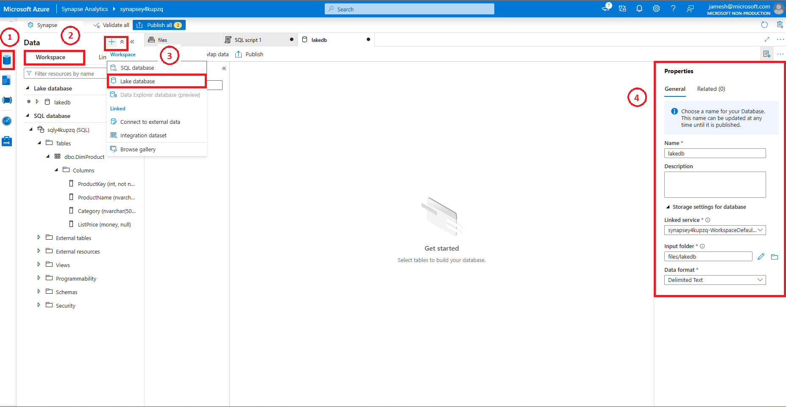
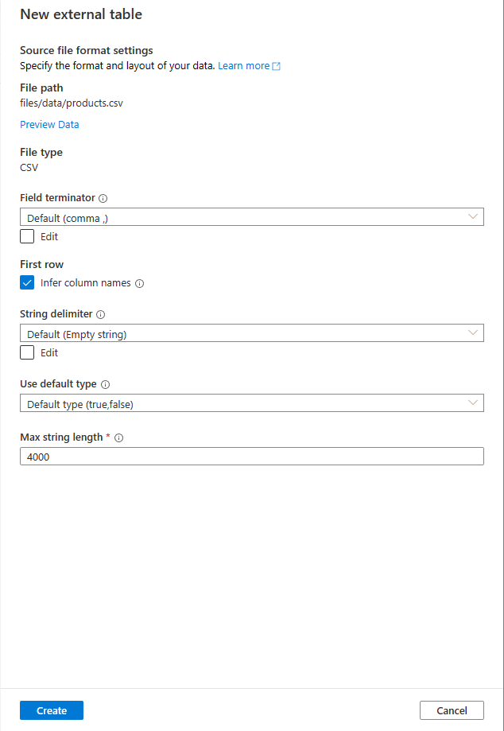
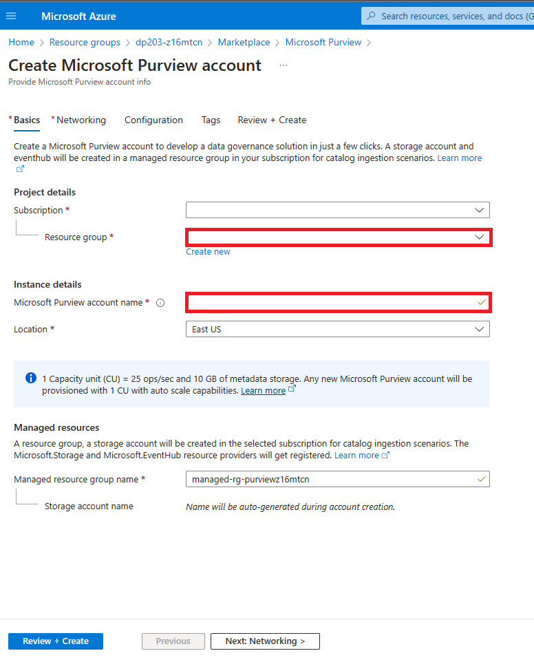
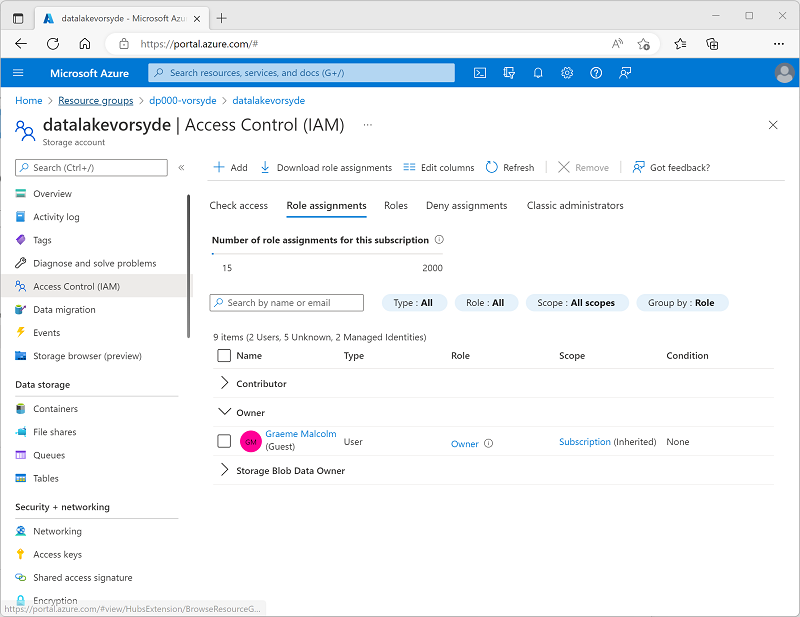

---
lab:
  title: Verwenden von Microsoft Purview mit Azure Synapse Analytics
  ilt-use: Lab
---

> **Wichtig**: Microsoft Purview wurde aktualisiert, und die Anzahl der verfügbaren Microsoft Purview-Konten pro Azure-Mandant ist jetzt eingeschränkt. Daher wird dieses Lab in freigegebenen Mandantenumgebungen nicht unterstützt, einschließlich vieler gehosteter Labumgebungen, die bei der Präsenzschulung verwendet werden.

# Verwenden von Microsoft Purview mit Azure Synapse Analytics

Microsoft Purview ermöglicht es Ihnen, Datenressourcen über Ihre Datenbestände hinweg zu katalogisieren und den Datenfluss während der Übertragung von einer Datenquelle in eine andere nachzuverfolgen – ein Schlüsselelement einer umfassenden Datengovernance-Lösung.

Diese Übung dauert ca. **40** Minuten.

## Vorbereitung

Sie benötigen ein [Azure-Abonnement](https://azure.microsoft.com/free), in dem Sie über Administratorrechte und exklusiven Zugriff auf den Mandanten verfügen, in dem das Abonnement definiert ist.

## Bereitstellen von Azure-Ressourcen

In dieser Übung verwenden Sie Microsoft Purview, um Ressourcen und Datenherkunft in einem Azure Synapse Analytics-Arbeitsbereich nachzuverfolgen. Sie verwenden zunächst ein Skript, um diese Ressourcen in Ihrem Azure-Abonnement bereitzustellen.

1. Melden Sie sich beim [Azure-Portal](https://portal.azure.com) unter `https://portal.azure.com` an.
2. Verwenden Sie rechts neben der Suchleiste oben auf der Seite die Schaltfläche **[\>_]**, um eine neue Cloud Shell-Instanz im Azure-Portal zu erstellen. Wählen Sie eine ***PowerShell***-Umgebung aus, und erstellen Sie Speicher, falls Sie dazu aufgefordert werden. Die Cloud Shell bietet eine Befehlszeilenschnittstelle in einem Bereich am unteren Rand des Azure-Portals, wie hier gezeigt:

    

    > **Hinweis**: Wenn Sie zuvor eine Cloud Shell erstellt haben, die eine *Bash*-Umgebung verwendet, ändern Sie diese mithilfe des Dropdownmenüs oben links im Cloud Shell-Bereich zu ***PowerShell***.

3. Beachten Sie, dass Sie die Größe der Cloud Shell durch Ziehen der Trennzeichenleiste oben im Bereich ändern können oder den Bereich mithilfe der Symbole **&#8212;**, **&#9723;** und **X** oben rechts minimieren, maximieren und schließen können. Weitere Informationen zur Verwendung von Azure Cloud Shell finden Sie in der [Azure Cloud Shell-Dokumentation](https://docs.microsoft.com/azure/cloud-shell/overview).

4. Geben Sie im PowerShell-Bereich die folgenden Befehle ein, um dieses Repository zu klonen:

    ```
    rm -r dp-203 -f
    git clone https://github.com/MicrosoftLearning/dp-203-azure-data-engineer dp-203
    ```

5. Nachdem das Repository geklont wurde, geben Sie die folgenden Befehle ein, um in den Ordner für dieses Lab zu wechseln. Führen Sie das darin enthaltene Skript **setup.ps1** aus:

    ```
    cd dp-203/Allfiles/labs/22
    ./setup.ps1
    ```

6. Wenn Sie dazu aufgefordert werden, wählen Sie aus, welches Abonnement Sie verwenden möchten (dies geschieht nur, wenn Sie Zugriff auf mehrere Azure-Abonnements haben).
7. Wenn Sie dazu aufgefordert werden, geben Sie ein geeignetes Kennwort für Ihre Azure SQL-Datenbank ein.

    > **Hinweis**: Merken Sie sich unbedingt dieses Kennwort!

8. Warten Sie, bis das Skript abgeschlossen ist. Dies dauert in der Regel etwa 15 Minuten, in einigen Fällen kann es jedoch länger dauern. Während Sie warten, lesen Sie den Artikel [Was ist im Microsoft Purview Governance-Portal verfügbar?](https://docs.microsoft.com/azure/purview/overview) in der Microsoft Purview-Dokumentation.

> **Tipp**: Falls Sie sich nach dem Ausführen des Setupskripts entschließen, das Lab nicht abzuschließen, löschen Sie die Ressourcengruppe **dp203-*xxxxxxx***, die in Ihrem Azure-Abonnement erstellt wurde, um unnötige Azure-Kosten zu vermeiden.

## Erstellen einer Lake-Datenbank

Lake-Datenbanken speichern Daten in einem Data Lake in Azure Storage. Sie können das Parquet-, Delta- oder CSV-Format und verschiedene Einstellungen verwenden, um Speicher zu optimieren. Jede Lake-Datenbank hat einen verknüpften Dienst, um den Stammdatenordner zu definieren.

Lake-Datenbanken sind in serverlosen SQL-Pools von Synapse SQL und in Apache Spark zugänglich, sodass Benutzer und Benutzerinnen den Speicher von der Berechnung trennen können. Die Metadaten der Lake-Datenbank erleichtern es den verschiedenen Engines, ein integriertes Erlebnis zu bieten und zusätzliche Informationen (z. B. Beziehungen) zu nutzen, die ursprünglich im Data Lake nicht unterstützt wurden.

1. Um eine Lake-Datenbank zu erstellen, öffnen wir zuerst die synapsexxxxxxxxx aus der entsprechenden Ressourcengruppe und klicken dann auf den Link ***Öffnen*** in der Karte **Synapse Studio öffnen**. 
2. Als Nächstes klicken wir auf den Werkzeugkasten mit dem Schraubenschlüssel darin, was auch dem Abschnitt „Verwalten“ des Synapse Analytics-Arbeitsbereichs entspricht, und stellen sicher, dass unser dedizierter Pool ausgeführt wird. Es kann einige Minuten dauern, bis dieser Vorgang gestartet wird.
3. Von hier aus klicken wir auf das Datenbanksymbol, das einem Fass ähnelt und ein Etikett für Daten hat.
4. Klicken Sie im Bereich „Daten“ rechts neben dem Wort **Daten** auf das Symbol +, und wählen Sie ***Lake-Datenbank*** aus.
   
    

> **Hinweis**: Sie werden aufgefordert, den **Nutzungsbedingungen für die Azure Synapse-Datenbankvorlage** zuzustimmen, die Sie lesen und verstehen sollten, bevor Sie auf die Schaltfläche **OK** klicken.

5. Auf der rechten Seite sehen Sie das Fenster „Eigenschaften“.
   1. Geben Sie in das Namensfeld **lakedb** ein.
   1. Wählen Sie unter **Eingabeordner** den Ordner aus, und navigieren Sie zu „root/files/data“, und klicken Sie dann auf **OK**.

>**Hinweis**: Beim Öffnen des **Eingabeordners** wird wahrscheinlich ein Fehler angezeigt. Doppelklicken Sie in diesem Fall einfach auf den Stammordner, und navigieren Sie nach unten zu den Daten, bevor Sie auf **OK** klicken.

   1. Links neben dieser Anzeige sehen Sie eine Säule mit dem Namen Ihrer **lakedb** mit der Schaltfläche **+ Tabelle** darunter. Klicken Sie auf diese, und wählen Sie ***Aus Data Lake*** aus.
   1. Geben sie unter ***Name der externen Tabelle*** Folgendes ein: **Produkte**.
   1. Wählen Sie unter ***Verknüpfter Dienst*** die Standardoption aus.
   1. Klicken Sie in der ***Eingabedatei oder im Eingabeordner*** ganz rechts auf den Dateiordner, und navigieren Sie zu **root > files > data >**, und wählen Sie ***products.csv*** aus. Klicken Sie auf **OK** und dann auf **Weiter**.

6. Wählen Sie im Bereich **Neue externe Tabelle** die Option „Erste Zeile“ aus, um ***Spaltennamen abzuleiten***, und klicken Sie dann auf **Erstellen**.



7. Klicken Sie oben im Abfrageentwurfsfenster auf **Veröffentlichen**.
8. Vergewissern Sie sich unter **Daten**, dass Sie sich im Bereich **Arbeitsbereich** auf der linken Seite befinden, und erweitern Sie den Abschnitt **Lake-Datenbank**, erweitern Sie dann **lakedb**, bewegen Sie dann den ***Mauscursor*** über die rechte Seite der Tabelle **Produkte**, und wählen Sie ***Die ersten 100 Zeilen*** aus.


> **Hinweis**: Stellen Sie sicher, dass die Option **Verbinden mit** den Wert **Integriert** hat. Sie können die **Masterdatenbank** ausgewählt lassen oder auf die Schaltfläche zum Aktualisieren auf der rechten Seite klicken und die Datenbank **lakedb** auswählen. Da eine dreiteilige Namenskonvention [Datenbank].[Schema].[Tabelle] verwendet wird, funktionieren beide Möglichkeiten.


9. Klicken Sie auf die Schaltfläche **Ausführen**, um die Daten in der Tabelle der Lake-Datenbank anzuzeigen.

## Microsoft Purview-Dienst zum Konto hinzufügen

Microsoft Purview ist ein umfassendes Portfolio von Produkten, das Datengovernance, Informationsschutz, Risikomanagement und Compliancelösungen beinhaltet. Es hilft Ihnen, Ihren gesamten Datenbestand über Ihre lokalen, Multi-Cloud- und Software-as-a-Service-Daten (SaaS) hinweg zu steuern, zu schützen und zu verwalten.

Um es einzurichten, kehren wir zuerst zu unserer Hauptressourcengruppe zurück, die basierend auf der Ihnen zugewiesenen Zufallszahl als „dp203-xxxxxxx“ benannt wird. Sobald Sie sich in der **Ressourcengruppe** befinden, klicken Sie auf die Schaltfläche ***+ Erstellen***, um einen neuen Dienst hinzuzufügen.

1. Wählen Sie den **Microsoft Purview-Dienst** aus, und klicken Sie dann auf die Schaltfläche **Erstellen**.
2. Da Sie in der entsprechenden Ressourcengruppe begonnen haben, sollte er während des Erstellungsprozesses bereits ausgewählt sein. Als Nächstes geben wir für **Purview** unter Verwendung Ihrer zufällig zugewiesenen Zahl einen Namen an. Wählen Sie als Nächstes die für Ihre Instanz am Besten geeignete Region aus.

   

3. Klicken Sie auf die Schaltfläche **Überprüfen und erstellen**, und warten Sie, bis die ***Prüfung*** abgeschlossen wurde, bevor Sie fortfahren.

   

4. Nachdem die Prüfung bestanden wurde, klicken Sie auf die Schaltfläche **Erstellen**.

> **Hinweis**: Möglicherweise müssen Sie einige Regionen ausprobieren, damit die Prüfung von Purview bestanden wird.

## Katalogisieren von Azure Synapse Analytics-Datenressourcen in Microsoft Purview

Mit Microsoft Purview können Sie Datenressourcen in Ihrem gesamten Datenbestand katalogisieren – einschließlich Datenquellen in einem Azure Synapse-Arbeitsbereich. Der soeben bereitgestellte Arbeitsbereich umfasst einen Data Lake (in einem Azure Data Lake Storage Gen2-Konto), eine serverlose Datenbank und ein Data Warehouse in einem dedizierten SQL-Pool.

### Konfigurieren des rollenbasierten Zugriffs für Microsoft Purview

Microsoft Purview ist für die Verwendung einer verwalteten Identität konfiguriert. Um Datenressourcen zu katalogisieren, muss dieses Konto mit verwalteter Identität Zugriff auf den Azure Synapse Analytics-Arbeitsbereich und das Speicherkonto für seinen Data Lake-Speicher haben.

1. Navigieren Sie im [Azure-Portal](https://portal.azure.com) zur Ressourcengruppe **dp203-*xxxxxxx***, die vom Setupskript erstellt wurde, und zeigen Sie die von ihr erstellten Ressourcen an. Dazu gehören:
    - Ein Speicherkonto, dessen Name **datalake*xxxxxxx*** ähnelt.
    - Ein Microsoft Purview-Konto, dessen Name **purview*xxxxxxx*** ähnelt.
    - Ein dedizierter SQL-Pool, dessen Name **sql*xxxxxxx*** ähnelt.
    - Ein Synapse-Arbeitsbereich, dessen Name **synapse*xxxxxxx*** ähnelt.
2. Öffnen Sie das Speicherkonto **datalake*xxxxxxx***, und zeigen Sie auf der Seite **Zugriffssteuerung (IAM)** die Registerkarte **Rollenzuweisungen** an, wie hier gezeigt:

    

3. Wählen Sie im Menü der Schaltfläche **+ Hinzufügen** die Option **Rollenzuweisung hinzufügen** aus. 
4. Suchen Sie auf der Seite **Rollenzuweisung hinzufügen** auf der Registerkarte **Rolle** nach „Speicherblob“ und wählen Sie die Rolle **Speicherblob-Datenleser** aus. Wählen Sie dann **Weiter** aus, um zur Registerkarte **Mitglieder** zu navigieren.

    

5. Wählen Sie auf der Registerkarte **Mitglieder** in der Liste **Zugriff zuweisen an** die Option **Verwaltete Identität** aus. Wählen Sie dann unter **Mitglieder** die Option **Mitglieder auswählen** aus.
6. Wählen Sie im Bereich **Verwaltete Identitäten auswählen** in der Liste **Verwaltete Identitäten** die Option **Microsoft Purview-Konto (*n*)** aus, und wählen Sie Ihr Microsoft Purview-Konto aus, dessen Name **purview*xxxxxxx*** ähneln sollte. Verwenden Sie die Schaltfläche **Auswählen**, um dieses Konto der Rollenzuweisung hinzuzufügen:

    

7. Verwenden Sie die Schaltfläche **Überprüfen und Zuweisen**, um die Rollenzuweisung abzuschließen. Dadurch wird das Konto **purview*xxxxxxx***, das von der verwalteten Identität für Ihre Microsoft Purview-Ressource verwendet wird, zum Mitglied der Rolle **Speicherblob-Datenleser** für Ihr Speicherkonto.
8. Kehren Sie im Azure-Portal zur Ressourcengruppe **dp203-*xxxxxxx*** zurück, und öffnen Sie den Synapse Analytics-Arbeitsbereich **synapse*xxxxxxx***. Fügen Sie dann auf der Seite **Zugriffssteuerung (IAM)** eine Rollenzuweisung hinzu, um das Konto mit verwalteter Identität **purview*xxxxxxx*** als Mitglied der Rolle **Leser** im Arbeitsbereich festzulegen.

### Konfigurieren der Datenbank-Berechtigungen für Microsoft Purview

Ihr Azure Synapse Analytics-Arbeitsbereich enthält Datenbanken sowohl in *serverlosen* als auch in *dedizierten* SQL-Pools, auf die die von Microsoft Purview verwendete verwaltete Identität Zugriff benötigt.

1. Zeigen Sie im Azure-Portal auf der Seite für Ihren Synapse Analytics-Arbeitsbereich die Registerkarte **Übersicht** an. Verwenden Sie dann in der Kachel **Synapse Studio öffnen** den Link, um Azure Synapse Studio in einer neuen Browserregisterkarte zu öffnen. Melden Sie sich an, wenn Sie dazu aufgefordert werden.

    >**Tipp**: Alternativ können Sie Azure Synapse Studio öffnen, indem Sie in einer neuen Browserregisterkarte direkt zu https://web.azuresynapse.net navigieren.

2. Verwenden Sie im linken Bereich von Synapse Studio das Symbol **&rsaquo;&rsaquo;**, um das Menü zu erweitern. Dadurch werden die verschiedenen Seiten in Synapse Studio angezeigt.
3. Wählen Sie auf der Seite **Verwalten** auf der Registerkarte **SQL-Pools** die Zeile für den dedizierten SQL-Pool **sql*xxxxxxx*** aus, und klicken Sie auf das zugehörige Symbol **&#9655;**, um ihn zu starten. Bestätigen Sie, dass Sie ihn fortsetzen möchten, wenn Sie dazu aufgefordert werden.

    

4. Warten Sie, bis der SQL-Pool fortgesetzt wird. Dies kann einige Minuten dauern. Sie können den Status mithilfe der Schaltfläche **&#8635; Aktualisieren** regelmäßig überprüfen. Der Status wird als **Online** angezeigt, wenn der SQL-Pool bereit ist.
5. Zeigen Sie in Azure Synapse Studio die Seite **Daten** an, erweitern Sie auf der Registerkarte **Arbeitsbereich** **SQL-Datenbank**, um die Datenbanken in Ihrem Arbeitsbereich anzuzeigen. Diese sollten folgende umfassen:
    - Eine serverlose SQL-Pool-Datenbank mit dem Namen **lakedb**.
    - Eine dedizierte SQL-Pool-Datenbank mit dem Namen **sql*xxxxxxx***.

    

6. Wählen Sie die Datenbank **lakedb** aus, und wählen Sie dann im Menü **…** **Neues SQL-Skript** > **Leeres Skript** aus, um einen neuen Bereich mit dem Namen **SQL-Skript 1** zu öffnen. Sie können die Schaltfläche **Eigenschaften** (die **&#128463;<sub>*</sub>** ähnelt) am rechten Ende der Symbolleiste verwenden, um den Bereich **Eigenschaften** auszublenden, damit Sie den Skriptbereich besser sehen können.
7. Geben Sie im Bereich **SQL-Skript 1** den folgenden SQL-Code ein, wodurch alle Instanzen von ***purviewxxxxxxx*** durch den Namen der verwalteten Identität für Ihr Microsoft Purview-Konto ersetzt werden:

    ```sql
    CREATE LOGIN purviewxxxxxxx FROM EXTERNAL PROVIDER;
    GO

    CREATE USER purviewxxxxxxx FOR LOGIN purviewxxxxxxx;
    GO

    ALTER ROLE db_datareader ADD MEMBER purviewxxxxxxx;
    GO
    ```

8. Verwenden Sie die Schaltfläche **&#9655; Ausführen**, um das Skript auszuführen. Dadurch wird ein Login im serverlosen Pool und ein Benutzer in der Datenbank **lakedb** für die von Microsoft Purview verwendete verwaltete Identität erstellt und der Benutzer der Rolle **db_datareader** in der Datenbank **lakedb** hinzugefügt.
9. Erstellen Sie ein neues leeres Skript für die dedizierte SQL-Pool-Datenbank **sql*xxxxxxx***, und verwenden Sie es, um den folgenden SQL-Code auszuführen (ersetzen Sie ***purviewxxxxxxxxx*** durch den Namen der verwalteten Identität für Ihr Microsoft Purview-Konto). Dadurch wird ein Benutzer im dedizierten SQL-Pool für die von Microsoft Purview verwendete verwaltete Identität erstellt und der Rolle **db_datareader** in der Datenbank **sql*xxxxxxx*** hinzugefügt.

    ```sql
    CREATE USER purviewxxxxxxx FROM EXTERNAL PROVIDER;
    GO

    EXEC sp_addrolemember 'db_datareader', purviewxxxxxxx;
    GO
    ```

### Registrieren von Quellen im Microsoft Purview-Katalog

Nachdem Sie nun den erforderlichen Zugriff für Microsoft Purview konfiguriert haben, um die von Ihrem Azure Synapse Analytics-Arbeitsbereich verwendeten Datenquellen zu scannen, können Sie sie in Ihrem Microsoft Purview-Katalog registrieren.

1. Wechseln Sie zurück zur Browserregisterkarte mit dem Azure-Portal, und zeigen Sie die Seite für die Ressourcengruppe **dp203-*xxxxxxx*** an.
2. Öffnen Sie das Microsoft Purview-Konto **purview*xxxxxxx***, und verwenden Sie den Link auf der Seite **Übersicht**, um das **Microsoft Purview Governanceportal** in einer neuen Browserregisterkarte zu öffnen. Melden Sie sich an, wenn Sie dazu aufgefordert werden.

    >**Tipp**: Alternativ können Sie in einer neuen Browserregisterkarte direkt zu https://web.purview.azure.com navigieren.

3. Verwenden Sie auf der linken Seite des Azure Purview-Governanceportals das Symbol **&rsaquo;&rsaquo;**, um das Menü zu erweitern. Dadurch werden die verschiedenen Seiten im Portal angezeigt.
4. Wählen Sie auf der Seite **Datenzuordnung** auf der Unterseite **Quellen** die Option **Registrieren** aus:

    

5. Wählen Sie auf der nun angezeigten Registerkarte **Quellen registrieren** die Option **Azure Synapse Analytics** aus, und registrieren Sie eine Quelle mit den folgenden Einstellungen:
    - **Name**: Synapse_data
    - **Azure-Abonnement**: *Wählen Sie Ihr Azure-Abonnement aus.*
    - **Arbeitsbereichsname**: *Wählen Sie Ihren Arbeitsbereich **synapsexxxxxxx** aus.*
    - **Dedizierter SQL-Endpunkt**: sql*xxxxxxx*.sql.azuresynapse.net
    - **Serverloser SQL-Endpunkt**: sql*xxxxxxx*-ondemand.sql.azuresynapse.net
    - **Sammlung auswählen**: Stamm (purview*xxxxxxx*)

    Diese Datenquelle enthält die SQL-Datenbanken in Ihrem Azure Synapse Analytics-Arbeitsbereich.

6. Nachdem Sie die Quelle **Synapse_data** registriert haben, wählen Sie **Registrieren** erneut aus, und registrieren Sie eine zweite Quelle für den Data Lake-Speicher, der von Ihrem Azure Synapse-Arbeitsbereich verwendet wird. Wählen Sie **Azure Data Lake Storage Gen2** aus, und geben Sie die folgenden Einstellungen an:
    - **Name**: Data_lake
    - **Azure-Abonnement**: *Wählen Sie Ihr Azure-Abonnement aus.*
    - **Arbeitsbereichsname**: *Wählen Sie Ihr Speicherkonto **datalakexxxxxxx** aus.*
    - **Endpunkt**: https:/ /datalakexxxxxxx.dfs.core.windows.net/
    - **Sammlung auswählen**: Stamm (purview*xxxxxxx*)
    - **Verwaltung der Datennutzung**: Deaktiviert

    Nachdem Sie sowohl die Quelle **Synapse_data** als auch die Quelle **Data_lake** registriert haben, sollten beide unter der Stammsammlung **purview*xxxxxxx*** in der Datenzuordnung angezeigt werden, wie hier gezeigt:

    

### Scannen von registrierten Quellen

1. Wählen Sie in der Datenzuordnung in der Quelle **Synapse_data** **Details anzeigen** aus, und beachten Sie, dass die Quelle keine katalogisierten Ressourcen enthält. Sie müssen die Quelle scannen, um die darin enthaltenen Datenressourcen zu finden.
2. Wählen Sie auf der Detailseite **Synapse_data** die Option **Neuer Scan** aus, und konfigurieren Sie dann einen Scan mit den folgenden Einstellungen:
    - **Name**: Scan-Synapse
    - **Mit Integration Runtime verbinden**: Azure AutoresolveIntegrationRuntime
    - **Typ**: SQL-Datenbank
    - **Anmeldeinformationen**: Microsoft Purview MSI (System)
    - **** SQL-Datenbank: *Wählen Sie <u>sowohl</u> die dedizierte Datenbank **sqlxxxxxxx** als auch die serverlose Datenbank **lakedb** aus.*
    - **Sammlung auswählen**: Stamm (purview*xxxxxxx*)

    

3. Fahren Sie mit der Seite **Scanregelsatz auswählen** fort, auf der der standardmäßige Regelsatz **AzureSynapseSQL** ausgewählt sein sollte.
4. Fahren Sie mit der Seite **Scantrigger festlegen** fort, und wählen Sie **Einmal** aus, um den Scan einmal auszuführen.
4. Fahren Sie mit der Seite **Ihren Scan überprüfen** fort, und speichern Sie den Scan, und führen Sie ihn aus.
6. Während der Scan **Synapse_data** ausgeführt wird, kehren Sie zur Seite **Quellen** zurück, um die Datenzuordnung anzuzeigen, und verwenden Sie in der Quelle **Data_lake** das Symbol **Neuer Scan**, um einen Scan des Data Lakes mit den folgenden Einstellungen zu starten:
    - **Name**: Scan-Data-Lake
    - **Mit Integration Runtime verbinden**: Azure AutoresolveIntegrationRuntime
    - **Anmeldeinformationen**: Microsoft Purview MSI (System)
    - **Sammlung auswählen**: Stamm (purview*xxxxxxx*)
    - **Bereich des Scans**: *Wählen Sie **Data_lake** und alle Unterressourcen aus.* 
    - **Scanregelsatz auswählen**: AdlsGen2
    - **Überprüfungstrigger festlegen**: Einmal
    - **Ihren Scan überprüfen**: Speichern und ausführen
7. Warten Sie, bis beide Scans abgeschlossen sind. Dieser Vorgang kann mehrere Minuten dauern. Sie können die Detailseite für jede einzelne Quelle anzeigen, um den **Status der letzten Ausführung** anzuzeigen, wie unten dargestellt (Sie können die Schaltfläche **&#8635; Aktualisieren** verwenden, um den Status zu aktualisieren). Sie können auch die Seite **Überwachen** anzeigen (es kann jedoch einige Zeit dauern, bis die Scans dort angezeigt werden):

    

### Anzeigen der gescannten Ressourcen

1. Wählen Sie auf der Seite **Datenkatalog** auf der Unterseite **Durchsuchen** die Sammlung **purview*xxxxxxx*** aus. Hier sehen Sie die Datenressourcen, die in Ihrem Azure Synapse-Arbeitsbereich und Data Lake-Speicher katalogisiert wurden, einschließlich des Azure Synapse Analytics-Arbeitsbereichs, des Azure Storage-Kontos für den Data Lake, der beiden SQL-Pool-Datenbanken in Azure Synapse Analytics, des Schemas **dbo** in jeder Datenbank, der Tabellen und Ansichten in den Datenbanken sowie der Ordner und Dateien im Data Lake.
2. Um die Ergebnisse zu filtern, wählen Sie in der Liste der Objekttypen **Ergebnisse filtern nach** die Optionen **Dateien** und **Tabellen** aus, sodass nur die Dateien, Tabellen und Ansichten aufgelistet werden, die durch den Scan katalogisiert wurden:

    

    Beachten Sie, dass die Datenressourcen Folgendes enthalten:

    - **products** – eine Tabelle im dedizierten SQL-Pool für Produktdaten.
    - **products.csv** – eine Datei im Data Lake.
    - **products_csv** – eine Ansicht im serverlosen SQL-Pool, die Produktdaten aus der Datei *products.csv* liest.

3. Erkunden Sie die gefundenen Ressourcen, indem Sie sie auswählen und deren Eigenschaften und Schema anzeigen. Sie können die Eigenschaften der Ressourcen (einschließlich einzelner Felder) bearbeiten, um Metadaten, Kategorisierungen, Kontaktdetails für Fachexperten und andere nützliche Details hinzuzufügen, damit Datenanalysten viele Informationen zu den Datenressourcen in Ihrem Datenbestand finden können, indem Sie sie im Microsoft Purview-Datenkatalog untersuchen.

Bisher haben Sie Microsoft Purview zum Katalogisieren von Datenressourcen in Ihrem Azure Synapse Analytics-Arbeitsbereich verwendet. Sie können mehrere Arten von Datenquellen in einem Microsoft Purview-Katalog registrieren und dadurch eine zentrale, konsolidierte Ansicht von Datenressourcen erstellen.

Sehen wir uns nun einige andere Möglichkeiten zur Integration von Azure Synapse Analytics und Microsoft Purview an.

## Integrieren von Microsoft Purview in Azure Synapse Analytics

Azure Synapse Analytics unterstützt die Integration in Microsoft Purview, um Datenressourcen auffindbar zu machen und die Datenherkunft über Erfassungspipelines nachzuverfolgen, die Daten von einer Quelle in eine andere übertragen.

### Aktivieren der Microsoft Purview-Integration in Azure Synapse Analytics

1. Wechseln Sie zurück zur Browserregisterkarte mit Synapse Studio, und wählen Sie auf der Seite **Verwalten** die Registerkarte **Microsoft Purview** aus. Verwenden Sie dann die Schaltfläche **Mit einem Purview-Konto verbinden**, um das Konto **purview*xxxxxxx*** in Ihrem Abonnement mit dem Arbeitsbereich zu verbinden.
2. Zeigen Sie nach dem Verbinden des Kontos die Registerkarte **Purview-Konto** an, um zu überprüfen, ob der Status **Datenherkunft – Synapse Pipeline** für das Konto **Verbunden** lautet:

    

### Durchsuchen des Purview-Katalogs in Synapse Studio

Nachdem Sie Ihr Microsoft Purview-Konto nun mit Ihrem Azure Synapse Analytics-Arbeitsbereich verbunden haben, können Sie den Katalog von Synapse Studio aus durchsuchen, sodass Sie Datenressourcen in Ihrem gesamten Datenbestand ermitteln können.

1. Navigieren Sie in Synapse Studio zur Seite **Integrieren**.
2. Verwenden Sie oben auf der Seite das Feld **Suche**, um die Quelle **Purview** nach dem Begriff „Produkte“ zu durchsuchen, wie hier gezeigt:

    

3. Wählen Sie in den Ergebnissen **products.csv** aus, um die Details aus dem Purview-Katalog anzuzeigen.

Durch die Integration des Purview-Katalogs in die Synapse Studio-Schnittstelle können Datenanalysten und technische Fachkräfte für Daten registrierte Datenressourcen aus dem gesamten Datenbestand (nicht nur innerhalb des Azure Synapse Studio-Arbeitsbereichs) finden und untersuchen.

### Erstellen und Ausführen einer Pipeline

Die Ansicht **products_csv** in der Datenbank **lakedb** basiert auf einer Textdatei im Data Lake, die Produktdaten enthält. Die Tabelle **Produkte** in der dedizierten SQL-Datenbank **sql*xxxxxxx*** ist zurzeit leer. Verwenden wir eine Synapse-Pipeline, um Daten aus dem Data Lake in die Tabelle zu laden.

1. Wählen Sie in Synapse Studio auf der Seite **Integrieren** im Menü **+** das Tool **Daten kopieren** aus.
2. Wählen Sie im Tool „Daten kopieren“ die Optionen **Integrierte Kopieraufgabe** und **Jetzt einmal ausführen** aus, und wählen Sie dann **Weiter** aus.
3. Wählen Sie auf der Seite **Quellendatenspeicher** in der Liste **Verbindung** die Verbindung **synapse*xxxxxxx*-WorkspaceDefaultStorage** aus (die auf den Data Lake für den Arbeitsbereich verweist), und navigieren Sie für die **Datei oder den Ordner** zur Datei **files/products/products.csv**. Wählen Sie dann **Weiter** aus.
4. Wählen Sie auf der Seite **Dateiformateinstellungen** die Option **Textformat erkennen** aus. Stellen Sie dann sicher, dass die folgenden Einstellungen angegeben sind, bevor Sie **Weiter** auswählen:
    - **Dateiformat**: DelimitedText
    - **Spaltentrennzeichen**: Komma (,)
    - **Zeilen-Trennzeichen**: Zeilenvorschub (\n)
    - **Erste Zeile ist Überschrift**: Ausgewählt
    - **Komprimierungstyp**: Keiner
5. Wählen Sie auf der Seite **Zieldatenspeicher** in der Liste **Verbindung** die Option **sql*xxxxxxx*** (die Verbindung mit Ihrem dedizierten SQL-Pool) aus. Legen Sie dann das Ziel auf die vorhandene Tabelle **dbo.products** fest, und wählen Sie **Weiter** aus.
6. Überprüfen Sie auf der Seite **Spaltenzuordnung** die Standard-Spaltenzuordnungen, und wählen Sie dann **Weiter** aus.
7. Legen Sie auf der Seite **Einstellungen** den **Aufgabennamen** auf **Load_Product_Data** fest. Wählen Sie dann die Kopiermethode **Einfügen per Massenvorgang** aus, und wählen Sie **Weiter** aus.
8. Wählen Sie auf der Seite **Zusammenfassung** die Option **Weiter** aus.
9. Warten Sie, bis die Pipeline bereitgestellt wird, und wählen Sie dann **Fertigstellen** aus.
10. Zeigen Sie in Synapse Studio die Seite **Überwachen** an. Beobachten Sie dann auf der Registerkarte **Pipelineausführungen** den Status der Pipeline **Load_Product_Data**. Es kann einige Minuten dauern, bis der Status zu **Erfolgreich** wechselt.
11. Wenn die Pipelineausführung erfolgreich abgeschlossen wurde, wählen Sie ihren Namen (**Load_Product_Data**) aus, um Details der Aktivitäten in der Pipeline anzuzeigen. Beachten Sie, dass die Pipeline die Aufgabe **Daten kopieren** mit einem automatisch abgeleiteten Namen enthält, der **Copy_* xxx*** ähnelt. Diese Aktivität hat die Daten aus der Textdatei im Data Lake in die Tabelle **Produkte** in der Datenbank **sql*xxxxxxx*** kopiert.

### Anzeigen der Datenherkunft in Microsoft Purview

Sie haben eine Synapse-Pipeline zum Laden von Daten in eine Datenbank verwendet. Überprüfen wir, ob diese Aktivität in Microsoft Purview nachverfolgt wurde.

1. Wechseln Sie zur Browserregisterkarte mit dem Microsoft Purview-Governanceportal.
2. Wählen Sie auf der Seite **Datenkatalog** auf der Unterseite **Durchsuchen** die Sammlung **purview*xxxxxxx*** aus.
3. Filtern Sie die Ressourcen, um nur **Datenpipelines**, **Dateien** und **Tabellen** anzuzeigen. Die Liste der Ressourcen sollte die Datei **products.csv**, die Pipelineaktivität **Copy_*xxx*** und die Tabelle **Produkte** enthalten.
4. Wählen Sie die Ressource **Copy_*xxx*** aus, um ihre Details anzuzeigen, wobei die **Aktualisierte Zeit** die letzte Pipelineausführung widerspiegelt.
5. Zeigen Sie auf der Registerkarte **Herkunft** für die Ressource **Copy_*xxx*** das Diagramm an, das den Datenfluss aus der Datei **products.csv** in die Tabelle **Produkte** zeigt:

    

6. Wählen Sie im Herkunftsdiagramm **Copy_*xxx*** die Datei **products.csv** aus, und verwenden Sie den Link **Zur Ressource wechseln**, um Details der Quelldatei anzuzeigen.
7. Wählen Sie im Herkunftsdiagramm **products.csv** die Tabelle **Produkte** aus, und verwenden Sie den Link **Zur Ressource wechseln**, um Details der Tabelle anzuzeigen (Möglicherweise müssen Sie die Schaltfläche **&#8635; Aktualisieren** verwenden, um das Herkunftsdiagramm der Tabelle anzuzeigen).

Die Integration von Azure Synapse Analytics in Microsoft Purview ermöglicht die Funktionalität zur Nachverfolgung der Herkunft, mit der Sie ermitteln können, wie und wann die Daten in Ihren Datenspeichern geladen wurden und woher sie stammen.

> **Tipp**: In dieser Übung haben Sie die Herkunftsinformationen im Microsoft Purview Governanceportal angezeigt. Denken Sie jedoch daran, dass dieselben Ressourcen auch in Synapse Studio über die Funktion zur Suchintegration angezeigt werden können.

### Anhalten des dedizierten SQL-Pools

1. Wechseln Sie zurück zur Registerkarte mit Synapse Studio, und halten Sie auf der Seite **Verwalten** den dedizierten SQL-Pool **sql*xxxxxxx*** an.

## Löschen von Azure-Ressourcen

Wenn Sie sich mit Azure Synapse Analytics vertraut gemacht haben, sollten Sie die erstellten Ressourcen löschen, um unnötige Azure-Kosten zu vermeiden.

1. Schließen Sie die Registerkarte mit Synapse Studio, und kehren Sie zum Azure-Portal zurück.
2. Wählen Sie auf der **Startseite** des Azure-Portals die Option **Ressourcengruppen** aus.
3. Wählen Sie die Ressourcengruppe **dp203-*xxxxxxx*** für Ihren Synapse Analytics-Arbeitsbereich aus (nicht die verwaltete Ressourcengruppe), und vergewissern Sie sich, dass sie den Synapse-Arbeitsbereich, das Speicherkonto und den dedizierten SQL-Pool für Ihren Arbeitsbereich enthält.
4. Wählen Sie oben auf der Seite **Übersicht** für Ihre Ressourcengruppe die Option **Ressourcengruppe löschen** aus.
5. Geben Sie den Namen der Ressourcengruppe **dp203-*xxxxxxx*** ein, um zu bestätigen, dass Sie sie löschen möchten, und wählen Sie **Löschen** aus.

    Nach einigen Minuten werden die Ressourcengruppe in Ihrem Azure Synapse-Arbeitsbereich und die damit verknüpfte Ressourcengruppe im verwalteten Arbeitsbereich gelöscht.
